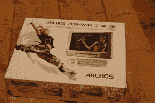
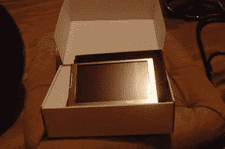
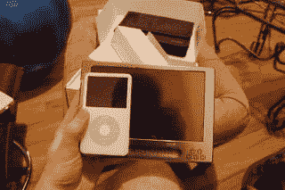
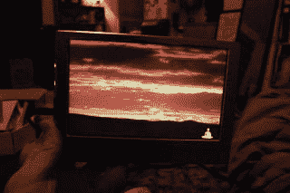

# 体验刚刚发布的爱可视 704-WiFi PMP–TechCrunch

> 原文：<https://web.archive.org/web/http://techcrunch.com/2007/03/06/hands-on-with-the-just-announced-archos-704-wifi-pmp/>

# 亲身体验刚刚发布的爱可视 704-WiFi PMP

午夜时分，Archos 拉开了他们功能齐全，但一点也不便携的 704-Wifi PMP 的帷幕(尽管它在形式上更接近于 UMPC 而不是 iPod。)这款 80GB、7 英寸屏幕的笔记本电脑集 WiFi 网络浏览和 DVR 功能于一身，支持常见的音乐/照片/视频业务。我们得到了也许是最具特色的球员，并采取了它的一个旋转。

 
这个箱子相当典型。

实际机组的设计可谓科幻。令人难以置信的光滑不锈钢表面在开箱后摸起来很冷，几乎整个表面都被 7 英寸的触摸屏占据。事实上，这东西上唯一的按钮是贴着两边的。

如你所见，这不是那种能和你一起慢跑的球员。

它的功能是无穷无尽的:除了通常的音频/视频/照片功能，它还能自动扫描开放的 WiFi 网络(因此得名)，并让你通过触摸屏上网。而且，像以前的 Archos 型号一样，一个可选的坞站可以将它变成一台移动 DVR。

屏幕是一个华丽的 800×480 像素，内置扬声器实际上有足够的能量来播放你的电影和音乐。像通常的 Archos 一样，编解码器支持是不错的:MPEG-4，AVI，ASP@L5，MP3，WMA，以及几乎死亡的 PlaysForSure 更不用说 PDF 阅读和添加更多扩展的可选插件。网络浏览器是最受欢迎的产品，售价 549.99 美元，比 iPhone 还好用。