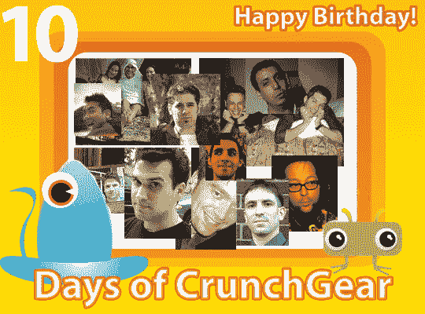

# 生日快乐，克朗彻格！

> 原文：<https://web.archive.org/web/http://techcrunch.com/2007/08/10/happy-birthday-crunchgear-2/>

一年前的今天，布雷克和我[推出了 CrunchGear](https://web.archive.org/web/20150907183022/http://crunchgear.com/2006/08/10/welcome-to-crunchgearcom/) ，这是小工具博客海洋中的另一个小工具博客。一年后，我们达到了 Technorati 前 100 名(就像彼得·哈的体重一样，我们倾向于在 100 分上下波动)，并且刚刚连续两个月完成了 100 万以上的浏览量。对于一群不适应环境的乌合之众来说，阻止邪恶帝国还不算太寒酸，对吧？

我们是怎么做到的？我们写了很多(迄今为止有 7791 篇帖子)，回顾了很多事情，每天都努力做到机智和/或有话题性。但是我们的成功真的要感谢谁呢？当然，我们的恩人[迈克尔](https://web.archive.org/web/20150907183022/http://www.techcrunch.com/)是一个我们在纯粹的柏拉图式的意义上已经喜欢和崇拜的人，但是你呢，我们的读者？你已经发表了 26512 条评论，无数次地说我们是笨蛋，并和我们同甘共苦。我们在性爱的意义上爱你。我们想感谢你。

欢迎参加为期 10 天的 CrunchGear 活动，这是我们的大规模读者赠品活动，有 30 多个奖品。你不必制作视频，但你必须执行一些任务——通常只是一封有特殊主题的电子邮件——才能获胜。我们想让这变得简单有趣。

我们将举办这些比赛 10 天，8 月 20 日，我们将在纽约举行聚会庆祝 CG。顺便说一下，如果你打算参加，请发电子邮件给 party@crunchgear.com。时间是晚上 7 点，地点在曼哈顿的某个秘密地点。

现在，我们将在 10 天结束时有一个非常特别的奖励。我们不想破坏悬念(*打嗝* iPhone)，但为了参加大奖，你必须参加所有其他比赛。这些竞赛大多只涉及发送电子邮件，所以不会很难。

总结一下:10 天内每天都有奖品，20 号在纽约开派对，如果你知道什么对你有好处，就参加所有的比赛。我们每天会有不止一场比赛，包括周末，所以请继续关注。公告将出现在这个网站和我们的[脸书小组](https://web.archive.org/web/20150907183022/http://www.facebook.com/group.php?gid=3473610402)。我们可以并将运送到欧洲和未知的部分，但我们不能负责关税。每场比赛你可以报名一次，也可以赢多次。

请继续关注第一份赠品，我要感谢你们所有人让这个网站变得如此棒。没有你们，我们不可能做到。为未来的许多生日干杯。