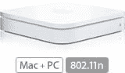

# 有英特尔 Mac 电脑吗？有五块钱吗？好的，你可以用 802.11n | TechCrunch

> 原文：<https://web.archive.org/web/http://techcrunch.com/2007/01/15/have-an-intel-mac-have-five-bucks-ok-you-can-use-80211n/>

偷偷摸摸的苹果。我记得在 iSight 问世的那一天，他们让我付费升级 iChat AV(当时不是普通的 iChat)。现在，如果你有一台英特尔 Mac 电脑，并想将其与苹果新的支持 802.11n 的 Airport Extreme 基站配合使用，你需要支付 4.99 美元购买一个允许你使用它的软件补丁。似乎苹果公司已经秘密地在基于英特尔的 MAC 电脑中安装 802.11n 有一段时间了。

哦好吧。如果你想要速度，而且对你来说这是值得的，那就快点结束，这样痛苦和悲伤就会减少到最低限度。

[苹果将向英特尔 Mac 用户征收 802.11n 解锁费](https://web.archive.org/web/20151006093033/http://www.appleinsider.com/article.php?id=2398)【苹果内幕】