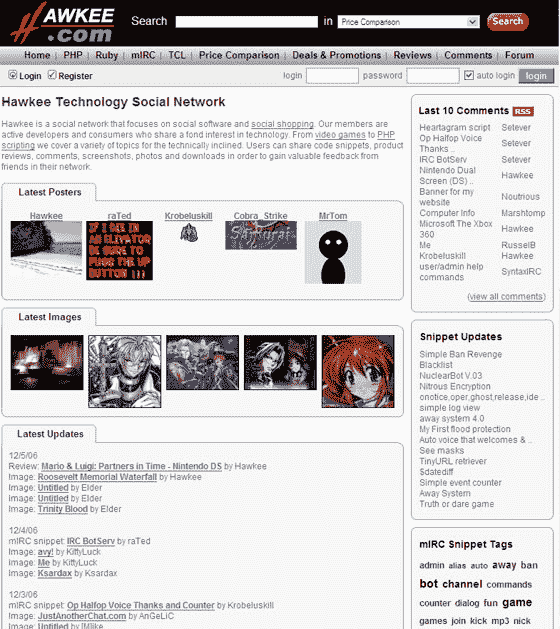

# Hawkee 成为极客的 MySpace | TechCrunch

> 原文：<https://web.archive.org/web/http://www.techcrunch.com:80/2006/12/05/hawkee-becomes-myspace-for-geeks/>

  传统上， [Hawkee](https://web.archive.org/web/20141017001958/http://www.hawkee.com/) 一直是开发者社区分享代码的地方，有点像社交网络。然而，从今天起，这个网站正式成为一个真正的社交网络。

正好赶上假期，Hawkee 的新重点是电子产品购物社交网络。用户可以比较各种电子产品的价格、观点和评论。产品被贴上标签，用户可以通过标签云进行过滤，找到他们想要的东西。他们还可以过滤标签，找到他们社交网络中的人写的评论。

Hawkee 的创始人斯科特·艾金(Scott Aikin)表示，他试图确保自己具备所有的“基本社交网络”功能。因此，您可以创建带有图片的个人资料，为您的朋友留下评论，发送私人消息等。但是你也可以阅读你朋友的推荐、片段和脚本，就像他们自己的个人博客一样。你也可以搜索他们在礼物赠送时间的愿望清单上标记的电子产品。

Hawkee 还有一个新的[交易页面](https://web.archive.org/web/20141017001958/http://www.hawkee.com/shop/promotions.php?mode=latest)，在那里 Aikin 和他的员工张贴优惠券，他们自己与供应商谈判，如[沃尔玛](https://web.archive.org/web/20141017001958/http://www.walmart.com/)和 [Overstock](https://web.archive.org/web/20141017001958/http://www.overstock.com/) 。

不幸的是，Hawkee 现在只有列出的产品的用户评论。艾金说，他正努力尝试与其他有产品评论的网站分享内容，比如亚马逊或者 CrunchGear。

“我想在假期结束前把它弄出来，这样它就不会像我希望的那样拥挤了，”艾金说。

霍基既不性感也不浮华，但是 MySpace 本身从来就不具备这两种特质。用户和内容是社交网络受欢迎和有用的原因，所以我认为 Hawkee 有潜力成为热爱小工具的社区所希望的那样热门。

