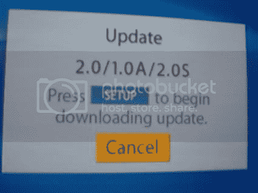

# HD DVD 2.0 今天发布

> 原文：<https://web.archive.org/web/http://techcrunch.com/2006/08/22/hd-dvd-20-is-coming-today/>

东芝最新的 HD DVD 固件将于今天发布。新版本将增加对 TrueHD 5.1 的 24 位/96kHz 离散音频通道的支持。没有确切的消息说这将会在什么时候发布，但是请注意。

[东芝周二将发布 HD DVD 2.0 固件](https://web.archive.org/web/20151001125818/http://www.hdbeat.com/2006/08/20/hd-dvd-2-0-firmware-to-be-released-on-tuesday/)【HD Beat via[Engadget](https://web.archive.org/web/20151001125818/http://www.engadget.com/2006/08/22/hd-dvd-2-0-firmware-to-be-released-by-toshiba-today/)