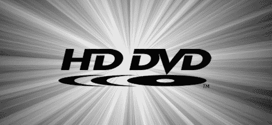

# HD DVD 支持者对百视达支持蓝光技术说“那又怎样”

> 原文：<https://web.archive.org/web/http://techcrunch.com/2007/06/22/hd-dvd-backers-says-so-what-to-blockbusters-support-of-blu-ray/>

独家支持 HD DVD 的环球影城，在回应租赁连锁店[决定](https://web.archive.org/web/20150522213010/http://crunchgear.com/2007/06/18/blockbluster-bravely-backs-blu-ray/)支持蓝光时，基本上对百视达嗤之以鼻。环球影业的一位营销经理说，像百视达这样的地方的租金收入只占其收入的不到百分之一。换句话说，损失不大。关于 HD DVD 世界末日的预言到此为止。

与此同时，微软再次明确声明无意支持蓝光，因为 HD DVD 对消费者更有利。它引用了 HD DVD 唱片和 HD DVD 唱片一成不变的标准作为它更好的原因之一。

[环球影业回应轰动一时的蓝光举措](https://web.archive.org/web/20150522213010/http://www.trustedreviews.com/multimedia/news/2007/06/21/Universal-Responds-to-Blockbuster-Blu-ray-Move/p1)【可信评论通过 [Xbox-Scene](https://web.archive.org/web/20150522213010/http://www.xbox-scene.com/xbox1data/sep/EElkuZEVkljtJxPGzX.php)