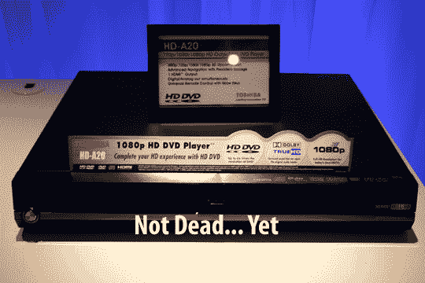

# 东芝称 HD DVD 没有死

> 原文：<https://web.archive.org/web/http://techcrunch.com/2007/07/02/hd-dvd-not-dead-not-even-close-says-toshiba/>

HD DVD 还没死，不管彼得和他的受访者怎么说。东芝周四与媒体达成协议，实质上是推销其 HD DVD 播放器和 Regza 高清电视。(老实说，我一点也不在乎谁会赢得高清光盘大战，所以我会很高兴地让各个阵营互相对抗，直到地狱冻结为止。)我要说的是，升级播放器固件的能力是东芝的一个明智之举，即将在 HD DVD 发布的 *300* 应该会给 HD DVD 的销售注入一些急需的活力。我们不允许在演示过程中拍照，但我们期待像屏幕上的画中画一样的功能，PIP 版本在应用许多蓝屏魔术之前显示战斗场景。

所以，让这场战争多打一会儿，孩子们，然后我们再去宣布胜利者。

[东芝](https://web.archive.org/web/20140224150112/http://www.toshiba.com/tai/)