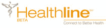

# Healthline 获得 2100 万美元和一些新朋友——TechCrunch

> 原文：<https://web.archive.org/web/http://www.techcrunch.com:80/2007/07/16/healthline-gets-21-million-and-some-new-friends/>

# 健康热线获得 2100 万美元和一些新朋友

 [Healthline](https://web.archive.org/web/20190206022830/http://www.crunchbase.com/company/healthline) 已将其手伸向由 GE/NBC Universal 的孔雀股权基金牵头的 2100 万美元 B 轮融资，该基金是 GE Commercial Finance 旗下媒体、通信和娱乐业务与 NBC Universal 的合资公司。这是他们去年一月[1400 万美元融资](https://web.archive.org/web/20190206022830/http://www.beta.techcrunch.com/2006/01/22/healthline-just-raised-serious-cash/)的最高值。此轮投资还包括 Aetna Ventures，LLC，Kaiser Permanente Ventures，U.S. News and World Report，以及之前的投资者 VantagePoint Venture Partners 和 Reed Elsevier Ventures 的小额投资。

他们还与安泰、美国在线、Ask.com 和 NBC 环球的 iVillage Total Health 达成了一些协议，使用他们的搜索和导航技术。AOL 曾经与 WebMD 有一项内容交易，后来选择了其他内容合作伙伴，Healthline 的加入为他们的搜索提供了动力。

健康搜索仍然是一个强大的垂直领域，因为搜索健康相关信息不仅仅使用关键字，还包括症状和相关疾病。在这个领域有很多其他的健康搜索引擎。微软最近收购了他们最接近的竞争对手 Medstory，该公司与 Healthline 最近发布的[症状搜索](https://web.archive.org/web/20190206022830/http://www.beta.techcrunch.com/2007/02/16/healthline-symptom-search-and-checktonight-for-when-youre-getting-down/)直接竞争。其他搜索引擎包括 [Healia](https://web.archive.org/web/20190206022830/http://healia.com/) 、 [Kosmix](https://web.archive.org/web/20190206022830/http://www.kosmix.com/health) ，甚至健康元搜索引擎[Mamahealth.com](https://web.archive.org/web/20190206022830/http://mamahealth.com/)。谷歌也有自己不太为人所知的基于合作平台的健康搜索引擎。