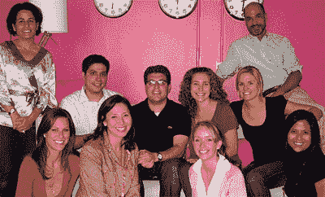

# 听说过 PopSugar 吗？

> 原文：<https://web.archive.org/web/http://www.techcrunch.com:80/2006/08/17/hear-about-popsugar-yet/>

如果你还没听说过总部位于三藩市的 PopSugar(T4 ),请做好准备。你将开始在主流媒体上听到很多关于他们的报道。他们是一个博客网络，最近是一个社交网络，目标是年轻、时髦的女性(以及一些想和年轻、时髦的女性在一起的男人)。

PopSugar 是由 Lisa 和 Brian Sugar 这对夫妻团队创立的。丽莎从去年秋天开始写博客 PopSugar 来找乐子。到二月份，页面浏览量增长如此之快，以至于他们放弃了 WordPress，建立了一个定制的 Drupal 基础设施，四月份他们正式推出了这个网络。公司至今自筹资金。

今天，PopSugar 实际上是四个不同的网站。最大的网站 PopSugar 本身就是一个关于名人新闻和八卦的博客。DearSugar 是一个“建议网站，致力于帮助读者解决围绕男人、工作、金钱、性、朋友和家庭的问题”。FabSugar 是一个讨论“所有必须拥有的时尚和美容产品”的博客。TeamSugar 是将一切联系在一起的东西——这是一个 Myspace 类型的社交网络，读者可以加入，添加他们的个人资料并相互交流。还有更多的网站正在建设中——本周早些时候我们交谈时，Brian 告诉我其中有 12 个网站处于规划阶段。

该网站群每月的页面浏览量超过 1300 万，独立访问者超过 150 万。要了解 PopSugar 读者有多狂热，请查看显示实时提交的新评论的页面。这是一个非常活跃的社区。

像 PopSugar 这样的网络，从忠实读者的核心基础迅速成长，并开始提供相关服务，很难与之竞争。内容的生产成本比旧式媒体公司低得多，速度也快得多(我说的旧式是指早期互联网的先驱，如 CNET、连线等。).在过去，创办一家媒体公司很难。没有办法和大家伙竞争。今天，大家伙们还在挠头。

下面是 Popsugar 团队。

