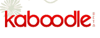

# 赫斯特以 3000 多万美元收购 Kaboodle 

> 原文：<https://web.archive.org/web/http://www.techcrunch.com:80/2007/08/08/hearst-acquires-kaboodle-for-30-million/>

# 赫斯特公司以 3000 多万美元收购 Kaboodle

 这是赫斯特互动媒体最近的第二次收购公告——上个月 [UGO 以大约 1 亿美元](https://web.archive.org/web/20221203183356/http://www.beta.techcrunch.com/2007/07/24/ugo-acquired-by-hearst-should-be-announced-today/)收购，今晚[他们宣布](https://web.archive.org/web/20221203183356/http://online.wsj.com/article/SB118653834941191320.html)收购 [Kaboodle](https://web.archive.org/web/20221203183356/http://www.crunchbase.com/company/kaboodle/) ，这是[于 2005 年末](https://web.archive.org/web/20221203183356/http://www.beta.techcrunch.com/2005/10/25/kaboodle-launch-bookmarking-wiki/)推出的社交购物服务。

一年前，由 Manish Chandra，Keiron McCammon，Chetan Pungaliya 创建的 Kaboodle 与易贝达成了一项重要的分销协议。康姆斯克的数据显示增长迅速，目前每月有 200 万左右的独立访客。

收购价格尚未披露，但我们听说它在 3000 万到 4000 万美元之间，全部是现金。该公司从 Shea Ventures、Kanwal Rekhi、杰夫·克拉维尔、罗恩·康韦、Garage Ventures、Georges Harik、Rajeev Motwani、Iggy Fanlo 和其他人那里筹集了总额为 500 万美元的三轮融资。

我们听说的另一件事是，投资者罗恩·康韦在促成这笔交易中发挥了“重要作用”。