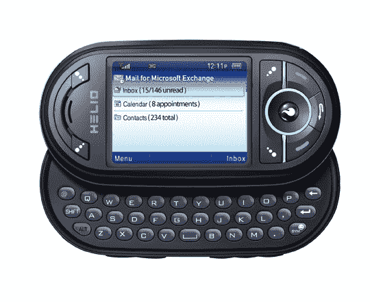

# Helio 推出微软 Exchange 邮件测试版

> 原文：<https://web.archive.org/web/http://techcrunch.com:80/2007/07/25/helio-launches-mail-for-microsoft-exchange-beta/>

哦，快乐的一天！Helio 昨晚正式发布了 MS Exchange 邮件测试版，因此所有讨厌商业用户的人都可以停止抱怨了。在接下来的 60 天里，所有拥有全包账户的海洋所有者都可以参与测试。您将能够从 MS Exchange Server OTA 同步您的联系人、日历和电子邮件。在测试期结束时，MS Exchange 的最终版本将以每月 9.99 美元的价格面向全包成员推出。若要开始，您需要与为 Exchange ActiveSync 协议设置的企业 Exchange 服务器同步，该协议与 Exchange Server 2003 SP2+或 ES 2007 兼容。

Helio 文件查看器也将在 30 天后推出，因此您可以在 Ocean 上查看 Word、Excel、PowerPoint 和 PDF 附件，并且对所有订户都是免费的。我告诉过你一些[热门新东西](https://web.archive.org/web/20151015171717/http://crunchgear.com/2007/07/19/msmv20-hits-helio-and-its-hot-hot-hot/)将来自 Helio。