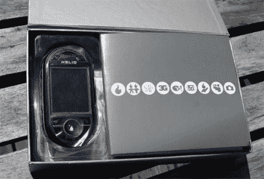

# Helio Ocean 第一印象| TechCrunch

> 原文：<https://web.archive.org/web/http://techcrunch.com:80/2007/05/09/helio-ocean-first-impressions/>

# 太阳神海洋第一印象

你准备好一些赤热拆箱行动了吗？我知道你是。来自 Helio 的海洋将于本周晚些时候上市，但哪些少女、易激动的博客作者会先得到它呢？CG，就是谁。这里有一些跳跃后的红热照片，一旦我们弄清楚这只猴子能做什么，期待明天下午的视频审查。

就尺寸而言，这款手机比 Sidekick 系列小得多，但独特的滑动机制可以在几秒钟内将它从 QWERTY 手机变成标准的键盘滑块。是否对得起早期的炒作？我们的初步印象是，这是休闲电子邮件和 AIM 智能手机市场的有力竞争者。我通常将操作系统与我最喜欢的“智能手机”操作系统 Danger 进行比较，我很高兴地告诉大家，这几乎和 Sidekick UI 一样简单。

布雷克和我今天下午将深入研究这个问题，当我们进行最终的、全面的审查时，我们会让你随时了解情况。在那之前，请尽情欣赏壮丽的海洋。

