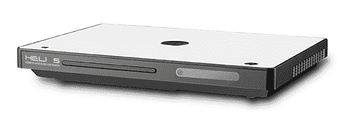

# Helios H2000 升级版 DVD 播放器:1080i，支持 XviD 

> 原文：<https://web.archive.org/web/http://techcrunch.com/2007/07/23/helios-h2000-upscaling-dvd-player-1080i-works-with-xvid/>

还被所谓的高清光盘格式战拖住了？8 月份，只要花 99 美元，你就能买到 Helios H2000 升级版 DVD 播放器。它通过 HDMI 或分量连接连接到您的 HDTV，并从任何数量的源将视频升级到 1080i，包括 Divx 和 XviD。不，它不如功能齐全的 HD DVD 或蓝光播放器令人满意，但如果你仍然喜欢普通的 DVD，它就能完成任务。

它的设计让我想起了 PS2slim(我拥有的)，这并不是那么糟糕。由于它可以与大多数可用格式兼容，我可以肯定地看到 H2000 在海盗湾人群中获得了牵引力。当然，99 美元可以让你做得更糟。所以，去吧，让 HD DVD 和蓝光阵营尖叫血腥的谋杀，而你坐在后面，享受像 ESiR 这样的发行团体所提供的。如果你能像苹果电视或 Xbox 媒体中心那样把它联网到你的电脑上就好了。下次吧，赫利俄斯。

[产品页面](https://web.archive.org/web/20150928065048/http://helios-labs.com/us/products/H2000/h2000_overview.shtml)【Helios via[Electronista](https://web.archive.org/web/20150928065048/http://www.electronista.com/articles/07/07/23/helios.h2000/)