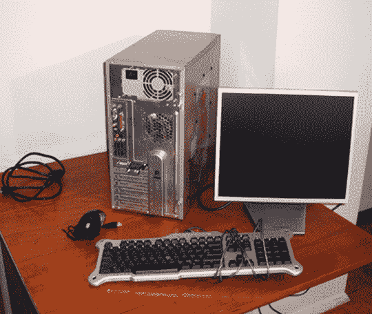
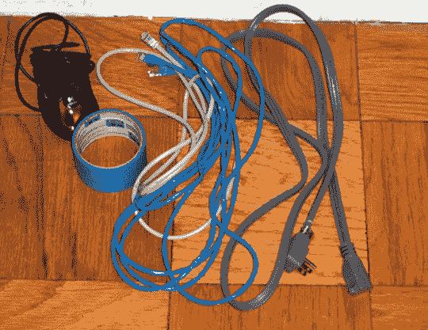
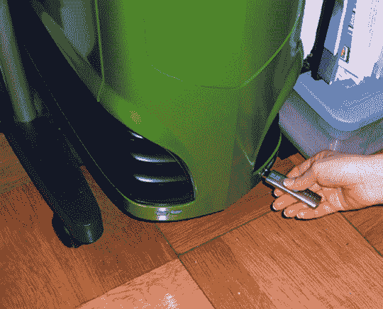
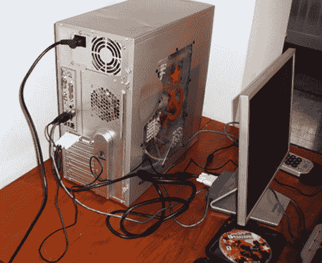
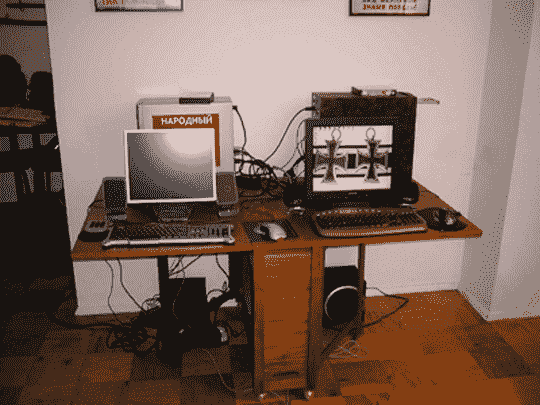
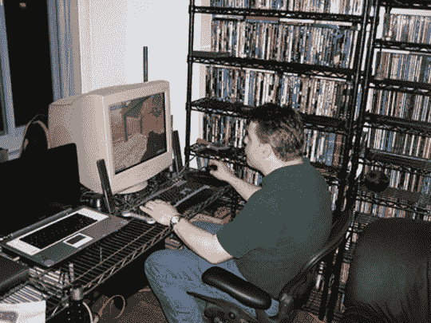
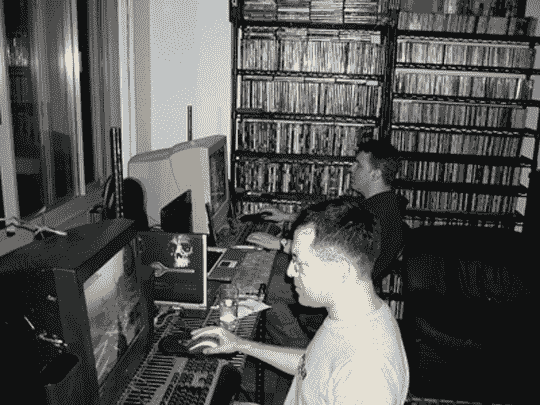

# 帮助键:举办一个很棒的局域网聚会

> 原文：<https://web.archive.org/web/http://techcrunch.com/2007/04/09/help-key-hosting-a-kickass-lan-party/>

一台好的游戏电脑和显示器已经准备就绪。

电脑游戏不一定是一种孤独的体验。今天，大多数射击游戏和策略游戏都有多种模式，和单人战役一样强大。你也不需要将你的多人游戏限制在你不能直接看到或与其他玩家交谈的线上游戏。与几个朋友聚在一起玩多人游戏增加了一个新的竞争层次，并带来了更多的社交体验。

**国内局域网聚会**
局域网聚会也不需要拖着你的系统去某个遥远的酒店参加一个大型的周末聚会。相反，在家里创造一个“着陆区”有很多选择。很有可能你不需要租用任何额外的机器来完成一个紧张的游戏之夜。你可以依靠你现有的机器，或者看看是否有一两个朋友可以提供一台笔记本电脑。但是不需要过度。

虽然让一大堆朋友带着他们的台式机的想法听起来很合理，但这可能会导致数小时的设置和故障时间。取而代之的是，试着找半打机器来进行一些三对三或者可能的四对四的游戏，让玩家轮换。即使是四台二对二的机器也能带来富有挑战性的体验。无论你能设置多少台机器，这都应该为每个人提供足够的游戏，同时保持事情的可控性——因为正如我们所知，在电脑上，你添加的东西越多，出错的可能性就越大。

**纸上谈兵一般的小技巧**
作为一个参加过几十个兰党的老兵，我可以说，这些可都是比工作更省力的。没有什么比在射击游戏中射击你的朋友或在战略游戏中摧毁他们的帝国更好的了。最重要的是提前计划，并有足够的时间进行布置换句话说，不要在每个人都到了之后才开始布置。更重要的是，如果事情出了差错，你需要在压力下保持冷静。你需要适应环境，这里有一些让事情变得更顺利的建议。有一个后备计划也有帮助。

确保你有包括鼠标、线缆和胶带在内的用品(防止线缆绊倒你的朋友)。

1)确保有足够的空间放置电脑，并为每台电脑准备足够的椅子。不要让事情变得不必要的拥挤。即使有笔记本电脑，玩家也应该有足够的舒适空间。

2)如果可能的话，有一个备份机器以防万一，并保持使用的计算机数量是偶数。这允许平衡的团队，并且有一台额外的计算机意味着你能在几分钟内换出一个系统并且仍然继续玩。

u 盘可以帮助你确保为所有的电脑准备好补丁。

3)没有什么比一个朋友拖着他的电脑穿过城市，却发现他忘记了一些重要的事情更糟糕的了。所以如果可能的话，试着多准备一个鼠标或键盘。无论你是否提供电脑，最好都有足够的 RJ-45 以太网电缆。可能有人会忘记带电缆，或者电缆太短。人们走来走去，拉着它们，这些电缆往往会在最糟糕的时刻报废。因此，有一些备用电缆是绝对必要的。为了安全起见，买一个电缆测试仪，它可以让你确定电缆是否坏了。当问题可能出在 PC 端时，这将节省您切换电缆的时间。

保持电缆井井有条，但也没有理由成为洁癖者。几个小时后你就要把这些都拆了。

4)尝试使用相同版本的操作系统。由于大多数局域网聚会可能是去参加基于 PC 的活动，这意味着你应该试着让机器运行 Windows XP(专业版更好)或 Windows Vista(暂时不推荐)。所有机器都应该使用最新的更新、补丁和驱动程序。这有助于确保机器不会在软件方面发现冲突。此外，更重要的是，游戏绝对需要相同的版本，因此作为主机，您应该有一个 CD-ROM 或 USB 拇指驱动器，其中加载了您计划运行的任何游戏的最新补丁，以及显卡驱动程序和 DirectX 的最新版本。当你更新驱动程序和修补软件时，没有人想无所事事！但如果必须这样做，让每个人都在一个光盘或 USB 驱动器上确实可以安全度过这个晚上。

这里有两台准备就绪的机器，但我忘了椅子吗？

5)使用服务器。如果可以的话，试着运行一个专用的服务器。这意味着你将马上失去一台机器，但这将允许改善游戏性。

一张折叠桌比让一个人弓着身子坐在咖啡桌旁更好。记住，椅子是先进先出的，所以告诉人们早点来。

6)每个游戏都有唯一的序列号。虽然购买六到八份游戏拷贝可能很贵，但你可以让你的朋友们在晚上提供他们自己的拷贝，这样你就不会遇到任何冲突。如果你想做一个“虚拟局域网”,让远方的朋友通过互联网加入你，这是绝对不可能的。
7)当您在网上玩局域网游戏时，安全是一个问题，所以安装某种防火墙也是一个好主意。内置的 Windows XP 防火墙有时会让游戏很难连接，但是像黑冰入侵者或诺顿网络安全特警这样的第三方安全程序可能是有意义的。像这样的程序有一个允许可信的 IP 地址和开放的游戏端口的设置。这样，机器可以免受黑客攻击，但仍然可以运行游戏。只需确保在晚上开始前测试一下，以确保没有太多的安全问题。
8)您要确保有足够的电量为每个人的电脑供电。如果可能，放弃台式扬声器，依靠耳机。这将减少对额外功率的需求，并保持音量舒适，所以那些不玩的人不需要大喊大叫就能被听到。别忘了拿几个额外的电源板和一根延长线，这样你也可以从另一个房间接入电源，以免任何电路过载。
9)使用耳机或其他方式时，请注意音量。即使你住在一所房子里，你也应该注意音量。如果你不使用耳机，无休止的枪声和爆炸声，以及一屋子的人可能会打扰邻居。所以要运用良好的判断力。
10)为观众准备合适的游戏。如果你是喜欢玩实时战略游戏的朋友，不要整晚都玩第一人称射击游戏。还要确保每个人都能上场。如果你的朋友正在提供他们自己的电脑，确保如果有人在他们去拿芯片和蘸酱时跳上他们的机器，这对他们来说很酷！
这可能是你的派对，但要确保你的客人有机会玩。如果其他任何人提供计算机，确保其他人可以接受使用它。如果没有，那么您也应该清楚这一点。
12)想想地图旋转、游戏时间限制和游戏模式。死亡竞赛总是一个最受欢迎的游戏，但是有时一个玩家统治了其他玩家，所以再次把它和捕捉旗帜和基于目标的游戏混合在一起会让每个人都闪耀片刻。
13)不要遗忘控制台。局域网聚会不需要严格的个人电脑事务。事实上，PlayStation 3、任天堂 Wii 和 Xbox 360 本身就是坚实的即时派对机器。即使你要开一个个人电脑派对，设置控制台来提供一些不同的东西，但仍然让每个人都参与游戏，这仍然是一个好主意。
14)玩得开心。这听起来可能很傻，但有时局域网派对主持人会把事情看得太重。如果你不喜欢输，就不要举办局域网聚会。毕竟，这不是你要举办的比赛。

即使你用的是笔记本电脑，也要看看你能否把它连接到显示器和全尺寸鼠标和键盘上。这改进了游戏设置

**备选场地**
好吧，那么你没有地方开 LAN 派对了，或者你的妻子/女朋友已经取消了你的计划。也有几个选择。
 *办公室射击节*——大多数办公室都联网在一起，只要你有一台相当快的机器，你就可以随时使用。没有什么比在办公室度过艰难的一天更像下班后玩游戏了。先和你的主管和 IT 部门核实一下，但是有可能一些工作场所的友情是受欢迎的。

电脑咖啡馆——电脑游戏厅和网吧开始为生日聚会和其他私人活动提供场所，包括专门用于游戏的活动。虽然比自己动手的活动贵一点，但你可以尝试以团体价格玩几个小时的闭门游戏。最好的部分是，如果出现任何技术问题，他们不会是你的问题！

所有的设置都是值得的，可以和好朋友玩一晚上游戏——你可以向他们开枪，摧毁他们的自我价值！