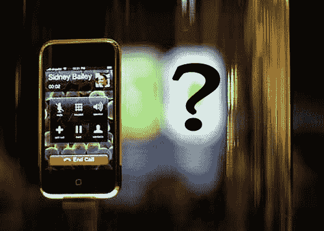
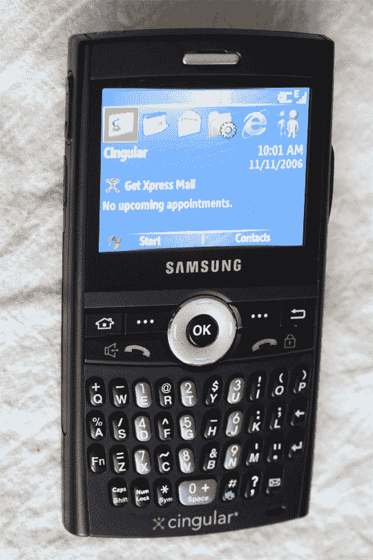
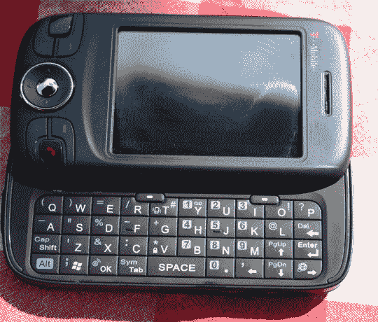

# 帮助键:如何摇滚不是 iPhone 的吸毒手机

> 原文：<https://web.archive.org/web/http://techcrunch.com/2007/06/25/help-key-how-to-rock-a-dope-phone-thats-not-an-iphone/>

读到这里，尤其是我写的，可能会让你们中的一些人感到惊讶，但我必须说:不是每个人都需要一部 [iPhone](https://web.archive.org/web/20160415150331/http://crunchgear.com/?s=iphone) 。当然，我像任何人一样渴望得到一台，但我不相信这是真的——所有一些人都在炒作它(不是苹果，顺便说一句)。不要误解我，我认为这是一个改变行业的设备，自 StarTAC 以来我们还没有见过这样的设备，但它对每个人都合适吗？更重要的是，它适合我吗？陪审团还没有决定。直到我有机会和它一起玩耍，摆弄它，用我粗糙的双手轻轻地抚摸它，我才会确切地知道。然而，我所知道的是，尽管大肆宣传，iPhone(不，我不会称之为“耶稣手机”)并不是唯一的游戏。不管你喜不喜欢，你已经准备好拥有一部真正的智能手机了。

这就是今天帮助键的重点:如何用非苹果的方式打开你的智能手机。

对于那些仍然在使用老式手机而不是功能丰富的智能手机的人，我想现在就用我们的[智能手机来帮助你们！](https://web.archive.org/web/20160415150331/http://crunchgear.com/2006/11/03/smarphones-now-2006/)作为引子。这是一批很好的作品，详细分析了智能手机的等级和文件，以及每种智能手机的优缺点，直到某些型号。但我们这里谈论的不仅仅是一组普通的手机，我们谈论的是 iPhone 的竞争对手，这意味着触摸屏、连接选项和可用性超出了你的黑莓手机。我们将研究一些这样的设备，看看我们是否能超越 iPhone。

问题是，有很多手机可能会与 iPhone 短兵相接，所以我们为你分析了几款，从 iPhone 自己的 AT & T(旧款 Cingular)上流行的[21 点](https://web.archive.org/web/20160415150331/http://crunchgear.com/2006/11/13/cingular-blackjack-review/)开始。21 点是衡量智能手机的一个标准。它具有 3G 连接功能，所以不需要像 iPhone 那样的 Wi-Fi。没有触摸屏，但取而代之的是一个完整的 QWERTY 键盘，这是 iPhone 为了给光滑的设计让路而失去的东西。就个人而言，我们对 iPhone 缺乏真正的键盘并不感到兴奋，这可能是该设备的致命弱点。

iPhone 的 200 万像素摄像头比 21 点的 130 万像素摄像头要好，而且都没有令人羡慕的闪光灯。此外，21 点运行的是饱受诟病的 Window Mobile 5 操作系统(至少目前如此),而不是 iPhone 光滑的 OS X 界面。但问题在于:面向 21 点和其他 Windows Mobile 设备的可安装应用程序即使没有数千个，也有数百个，而苹果不允许任何人不通过 Safari 入口就进入 iPhone。我们认为这是其他人已经解决的 iPhone 的另一个问题。

如果你在寻找功能更强大但同样纤薄的产品，明智的做法是看看 T-Mobile 的 [Wing。虽然它没有 Blackjack 的超高速 3G 功能，但它有 Wi-Fi，所以如果你在无线友好的大都市地区，你可以更快地上网。此外，它有一个像样的触摸屏，很像 iPhone。还有一个拉出式 QWERTY 键盘，非常漂亮。Wing 和 Blackjack 一样，运行的是 Windows Mobile，不是最好的操作系统，但可以很好地设计(在即将到来的 Help-Key 中会有更多的介绍)。](https://web.archive.org/web/20160415150331/http://crunchgear.com/2007/05/22/t-mobile-wing-review/)

但假设你对 iPhone 的 iPod 方面更感兴趣。我们也帮你搞定了。播放音乐的手机并不是什么新鲜事，苹果自己甚至也涉足了这个市场。话虽如此，但没有一家公司真的像它们本可以做到的那样起飞了。手机制造商已经做出了足够的妥协，它们往往既不是伟大的音乐设备，也不是手机，运营商已经给它们定了足够的价格，以至于它们在各方面都没有吸引力。尽管如此，即将到来的[诺基亚 5700](https://web.archive.org/web/20160415150331/http://crunchgear.com/2007/03/29/nokia-5700-xpressmusic-officialized/) 还是有希望的。

虽然在美国还没有任何官方运营商，但 5700 集音乐手机和智能手机的所有要素于一身。这款手机运行诺基亚的 S60 版塞班操作系统，有数千个可安装的应用程序，背面有一个带音乐控制的旋转键盘。200 万像素的摄像头与 iPhone 相当，但价格只有一半。真正值得关注的手机。

如果你的媒体需求超出了音乐，你会想要一个非常棒的屏幕。虽然 iPhone 确实给了我们几个月来一直在问他的宽屏 iPod，但它仍然，嗯，很小。进入[爱可视 704-WiFi](https://web.archive.org/web/20160415150331/http://crunchgear.com/2007/03/06/hands-on-with-the-just-announced-archos-704-wifi-pmp/) 。无论如何，704 不是一部手机，而是严肃媒体朋友的 PMP。这个家伙有 7 英寸的触摸屏，内置 Wi-Fi 和 Opera 的最新浏览器，除了打电话，什么都可以做。将其与您最喜爱的超薄手机配对，并意识到融合并不总是可行的。当然，它并不适合所有人，但同样，iPhone 也不适合。

对于那些想要更便携的选择的人来说，可以考虑将你最喜欢的手机与诺基亚 N800 T4 平板电脑进行蓝牙配对。这款小型互联网设备本身就是一个媒体发电站，外形与 iPhone 大致相同，拥有更多功能，如内置视频会议。当然，你需要一部带有上网数据套餐的手机，但 iPhone 也是如此(至少我们是这么认为的)。当我们的编辑约翰·比格斯摸索 N800 时，他坠入了爱河，他是金牛座，所以这说明了一些问题。

但是，如果你正在寻找一个小包装中的上述所有东西，请考虑来自 Palm 的基于 Palm OS 的 Treo 系列。易于与 iPhones 等触摸屏一起使用(嗯，至少它们是触摸屏)，大量易于定制的可下载应用程序，完整的 QWERTY 键盘，媒体播放，互联网连接选项和蓝牙使它们真正值得再看一眼。大多数人需要的应用程序都是内置的，附加程序很容易下载和安装。Treo 用户如此热衷于他们的手机是有原因的，如果你最近还没有尝试过，也许你应该尝试一下。不管你有什么样的承运人，你今天都有很大的机会拿到一个。朋友，这是比 AT&T/苹果 iPhone 更好的优势。

总而言之，我和其他人一样对 iPhone 感到兴奋。我认为，iPhone 不仅会影响智能手机行业，还会影响整个无线手机行业(我知道，这并不是在冒险)。由于这款机器本身将可用性置于闪亮之上(并不是说它完全忽视了闪亮)，它设置了一个别人必须努力达到的门槛。此外，美国电话电报公司和苹果在如何共同营销这款设备上的协同效应本身就很重要；传言中的语音和数据费率计划很可能会在整个无线世界引发巨大的涟漪，这意味着对每个人来说更好的服务和价格，不管是不是 iPhone 用户。

希望这篇指南能帮助你更好地了解 iPhone 所处的环境，并且，推而广之，也能帮助你弄清楚你是适合 iPhone 的人，还是能够抵制宣传并仍然按照你的方式做事的人。