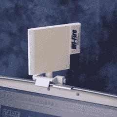

# hField Wi-Fire:从 1000 英尺外窃取他人的互联网

> 原文：<https://web.archive.org/web/http://techcrunch.com/2007/08/13/hfield-wi-fire-steal-someones-internets-from-1000-feet-away/>

如果你像我一样便宜，那么 Wi-Fire 是你应该考虑的互联网需求。我可以在我的公寓周围看到至少 15 个网络，但大多数是加密的或信号太弱。多亏了这个精巧的扩展范围的 USB 设备，我能够接收 1000 英尺外的信号。又一个不用付网费的月，太棒了。它非常适合没钱的学生或公司因为太便宜而无法提供宽带卡的商业人士。

我讨厌在任何笔记本电脑上安装臃肿的软件，但 Wi-Fire 让时间和硬盘空间变得物有所值。UI 易于导航，并提供周围所有信号的统计数据。当它接收到住在街对面的一个朋友网络时，我知道它工作正常。它看起来有点丑，但是可以很好地折叠起来，放在我的笔记本电脑包里也不会很痛。现在售价 109 美元。

[产品页面](https://web.archive.org/web/20150922194727/http://www.hfield.com/wifire.htm)