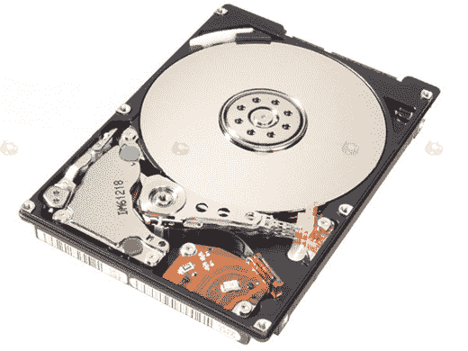

# 日立的 Travelstar 7K200 是世界上最快的笔记本电脑硬盘:比仅次于它的 TechCrunch 快 22%

> 原文：<https://web.archive.org/web/http://techcrunch.com/2007/05/11/hitachis-travelstar-7k200-is-worlds-fastest-notebook-hard-drive-22-percent-faster-than-next-best/>

日立的 Travelstar 7K200 硬盘据说是世界上最快的笔记本硬盘，传输速度据称比其最接近的竞争对手快 22%。这款 2.5 英寸硬盘有 80、100、120、160 和 200GB 四种规格，对于这种尺寸的硬盘来说，这并不算太差。该驱动器甚至内置了文件加密功能，这一功能如今变得越来越普遍，尤其是在笔记本电脑驱动器上。它应该会在今年夏天上市，200GB 的价格在 250 美元左右。变焦！

[新闻稿](https://web.archive.org/web/20140709141343/http://www.hitachigst.com/portal/site/en/template.MAXIMIZE/menuitem.368c8bfe833dee8056fb11f0aac4f0a0/?javax.portlet.tpst=74ef8e8d695bcd876ccf7be1cf4362b4_ws_MX&javax.portlet.prp_74ef8e8d695bcd876ccf7be1cf4362b4_viewID=content&javax.portlet.prp_74ef8e8d695bcd876ccf7be1cf4362b4_docName=20070510_ships_speediest.html&javax.portlet.prp_74ef8e8d695bcd876ccf7be1cf4362b4_folderPath=%2Fhgst%2Faboutus%2Fpress%2Finternal_news%2F&beanID=804390503&viewID=content&javax.portlet.begCacheTok=token&javax.portlet.endCacheTok=token)【日立 via [秋叶原新闻](https://web.archive.org/web/20140709141343/http://www.akihabaranews.com/en/news-13810-Travelstar+7K200%2C+the+world%27s+fastest+HDD.html)