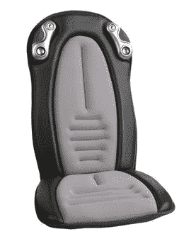

# HoMedics 发布 iCush–TechCrunch

> 原文：<https://web.archive.org/web/http://techcrunch.com/2006/08/22/homedics-release-icush/>

iCush 允许玩家通过用户控制的振动沉浸在游戏中。iCush 集成了控件，允许用户控制振动的温度、速度、强度和位置，所有这些都与游戏同步。如果在现实生活中被枪击或刺伤感觉像按摩就好了。只需 119.95 美元，iCush 就可以是你的了。

iCush 只需插入您的音频端口，并为您的游戏增加物理感觉。有嵌入式扬声器和振动装置，显然它独立于内容运行，所以你可以随着*音乐之声*摇滚，并在每次冯特普达到高音时让自己温暖。

[iCush](https://web.archive.org/web/20201123195853/http://www.homedics.com/) 【产品页面】