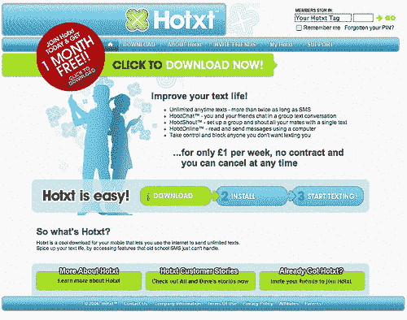
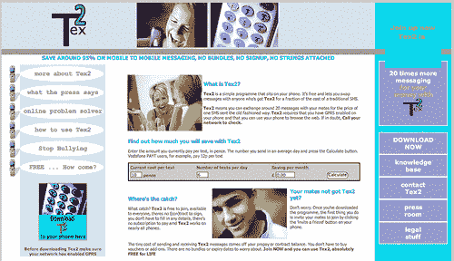

# Hotxt 瞄准社交网络空间

> 原文：<https://web.archive.org/web/http://techcrunch.com/2006/11/03/hotxt-aims-at-social-networking-space-2/>

[
Hotxt](https://web.archive.org/web/20141020195349/http://www.hotxt.co.uk/) 是一种低成本的无限制短信服务，它使用手机上的客户端应用程序通过互联网向其他 Hotxt 用户发送短信，该服务增加了新的社交网络功能，旨在为 1259 万 24 岁以下的手机用户提供短信，而不是通话。

Hotxt 的新功能包括群发消息、带有文本的在线“网络电子邮件”界面、“国外的家人或朋友”功能和广播文本。它提供每周 1 英镑(1.79 美元)的“吃到饱”价格，比短信便宜得多。

Hotxt 由因 BBC[龙穴](https://web.archive.org/web/20141020195349/http://www.bbc.co.uk/dragonsden/)而出名的道格·理查德和[图书馆](https://web.archive.org/web/20141020195349/http://libraryhouse.net/)的创始人大卫·怀特伍德创建。它于 2006 年 3 月推出，7 月从全球另类资产管理公司都铎投资公司获得 650 万美元的 A 轮融资。

在与 TCUK 的独家采访中，Doug Richard 说 Hotxt 的定位是利用我们对信息的贪得无厌的胃口。“英国的短信业务又有了巨大的增长。我们不能满足于短信，”他说。他认为 Hotxt 是新一代新公司的一部分，这些公司希望利用移动和网络融合的新优势。

他说，Hotxt 的下一个阶段是提供一个与社交网站的接口，目前正在与其中一些网站进行讨论。“我们的目的是让 Hotxt 能够与在线即时通讯、社交通讯、Bebo、Myspace 等网站进行交互。”

Hotxt 的商业模式几乎没有竞争对手，但在英国最接近的是“朋友和家人”资助的 [Tex2Me](https://web.archive.org/web/20141020195349/http://www.tex2me.com/) (如下图)，于 2005 年 12 月以小本经营推出。Tex2Me 提供“无附加条件”的免费服务(除了运营商的数据收费)，它没有订阅模式，这使它更像 Skype。然而，Tex2Me 不太可能有任何接近 Hotxt 的营销预算，而且它没有 Hotxt 的“Out”服务，该服务使用户能够以比普通文本更低的成本向没有 Hotxt 应用程序的人发送文本。[ **更新** : **我刚刚和 [Tex2Me](https://web.archive.org/web/20141020195349/http://www.tex2me.com/) 的斯图尔特·麦克威廉通过电话，他说这项功能将很快在新的测试版中以批量预付费的方式提供，他们将很快宣布一个主要支持者]。
**

作为一名著名的投资者，理查德说现在的风险投资环境很好:“现在是创办新公司的绝佳时机。英国是一个非常好的地方。没有硅谷那么好，但也很不错。但我还是会在英国开一家手机公司，而不是硅谷。”

关于初创企业可用的资本，他说:“现在有大量可用的资本，不存在供应不足的问题。图书馆 6 月份的一份报告衡量并分析了英国的风险投资，我们能够表明，绝大部分投资都投向了‘假定的’缺口。”

“投资者正在投资这个缺口，所以这不是问题。问题是，有很多业务比收到的资金多。我很难找到没有获得融资的可投资公司。最大的抱怨是没有足够的可投资公司，”他补充道。

他表示，部分问题在于企业家缺乏对投资过程和投资者需求的了解。