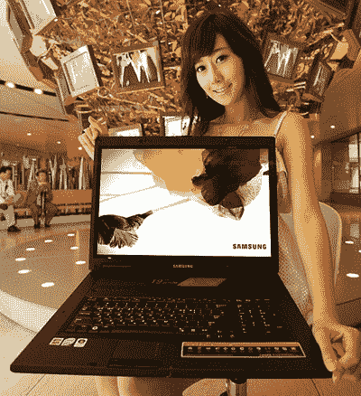

# 多大才算太大？三星 19 英寸 SENS G25 笔记本| TechCrunch

> 原文：<https://web.archive.org/web/http://techcrunch.com/2007/07/17/how-big-is-too-big-samsungs-19-inch-sens-g25-notebook/>

# 多大才算太大？三星的 19 英寸 SENS G25 笔记本

我个人认为桌面替换有点傻(iMacs 真的占那么多空间吗？)，但许多人不同意这种观点，包括三星。其即将推出的 SENS G25 笔记本电脑有一个可笑的大 19 英寸显示屏，并由其他组件支撑，你很快就会期待在一个完整的桌面上…也许。事实上，我们现在唯一的“事实”是，它将配备 320GB SATA 硬盘，并配有酷睿 2 双核处理器。它有一个 ATI GPU，我们只是不知道是哪一个。

但是 19 寸的笔记本。我觉得有些奇怪。给我一个“你永远不需要超过 64K 内存”的家伙。

[三星](https://web.archive.org/web/20130628195523/http://www.akihabaranews.com/en/news-14375-19+inches+for+your+Notebook%2C+by+Samsung.html)【秋叶原新闻】19 英寸笔记本电脑