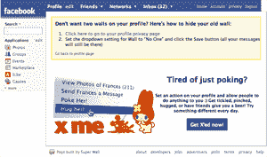

# 一个脸书用户值多少钱？至少 0.30 美元 

> 原文：<https://web.archive.org/web/http://www.techcrunch.com:80/2007/07/27/how-much-is-a-facebook-user-worth-at-least-030/>

人们没有浪费任何时间试图找出如何从过去几个月在[涌现的数以千计的](https://web.archive.org/web/20211201220333/http://www.beta.techcrunch.com/2007/05/24/facebook-launches-facebook-platform-they-are-the-anti-myspace/)[脸书](https://web.archive.org/web/20211201220333/http://www.crunchbase.com/company/facebook)应用中赚钱。至少有三项广告试验已经启动——到目前为止，最有希望的是 RockYou。

FB exchange

第一个出门的是 [FBExchange](https://web.archive.org/web/20211201220333/http://fbexchange.com/) ，这是 90 年代 LinkExchange 理念的翻版。它是由 30 盒日历团队——纳伦德拉·罗谢尔、朱莉·戴维森和尼克·怀尔德创作的。在你的 facebook 应用程序上显示别人的广告，积累点数，然后可以用来在其他应用程序上运行你自己的广告。如果病毒式的脸书机器没有创造足够的增长让你满意，这是一个让你的应用程序获得曝光的廉价而简单的方法。详见 [GigaOm](https://web.archive.org/web/20211201220333/http://gigaom.com/2007/07/10/fbexchange/) 。该公司表示，仅上线两周，他们就获得了 20 万美元的收入。
 **Lookery**

 [Lookery](https://web.archive.org/web/20211201220333/http://www.lookery.com/) ，由连续创业者 Scott Rafer 创立，是一个直接面向脸书应用的[广告网络](https://web.archive.org/web/20211201220333/http://gigaom.com/2007/07/11/scott-rafer-is-facebooking-launching-lookery/)。他们表示，他们将获得用户的深层人口统计数据，因此可以针对具有非常具体特征的用户投放广告，例如，年龄在 20-25 岁之间的纽约女性。理论上，这将导致更高的广告费用。我喜欢这个想法，但脸书本身也可以获得同样的数据，甚至更多，而且在大规模销售高 CPM 广告方面存在困难。Lookery 需要大规模才能成功，因此在早期可能会很艰难。目前，Rafer 说，他们正在将 100%的收入交给内容提供商，并且将在一个月左右的时间里，当经济状况支持时，开始削减。

 **RockYou**

 [RockYou](https://web.archive.org/web/20211201220333/http://www.crunchbase.com/company/rockyou) 一直在悄悄测试自己的一个广告网络的想法——向其他应用出售“用户”。到目前为止，他们已经在脸书上成功构建了大量的病毒式应用程序。例如，他们的超级墙应用程序拥有近 300 万用户，并且每天增加数十万新用户。基本上就是它所说的——一个更好的“墙”,朋友可以在这里留言。有了超级墙，人们可以添加图片、视频和其他富媒体。

他们提议在超级长城上推广第三方应用，并按每用户获得量(CPA)收费。当用户注册超级墙时，系统会询问他们是否也想添加一个额外的应用程序(广告商)。查看右边的屏幕截图(点击查看大图)。

到目前为止，测试进行得非常顺利。首席执行官 Lance Tokuda 今天告诉我，他们仅在四个小时内就转移了 3 万美元的库存。他们正在测试各种价位，**但低端似乎是每个用户 0.30 美元左右，他们卖给另一个应用**，他们相信随着时间的推移，他们可以得到多达 1 美元。他说，有效的 CPM(或每 1000 页的收入)是“20 美元的倍数”。这使得他们可能是第一个发现真正的用户和浏览量货币化的脸书应用。

Tokuda 还表示，他们已经为超级墙开发了一个 API，并将免费提供给其他应用程序，以将他们的功能构建到其中。这可能会让你有点头晕——脸书现在被广泛认为是一个平台，而现在超级长城是一个平台上的平台。我想这是一件好事，没有人放慢脚步去认真思考网络世界发展的速度。相反，他们在疯狂地实验。有些东西会一直存在。