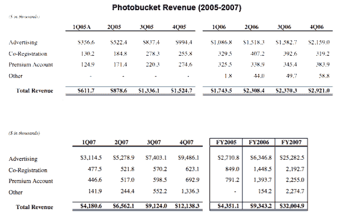
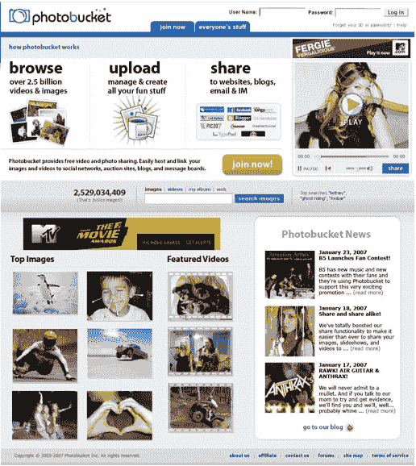

# Photobucket 值多少钱？

> 原文：<https://web.archive.org/web/http://www.techcrunch.com:80/2007/03/29/how-much-is-photobucket-worth/>

  位于硅谷/科罗拉多州的照片和视频分享网站 [Photobucket](https://web.archive.org/web/20220928230152/http://www.photobucket.com/) 拥有 3600 万注册用户，并且每天增加 85000 人。如果增长率持续下去，到今年年底他们将拥有 6000 万用户。每月有 1700 万用户访问 Photobucket，比脸书还多。这些用户中有 56%不到 35 岁，52%是女性。300，000 个独特的网站链接回 Photobucket。他们[移动大量数据](https://web.archive.org/web/20220928230152/http://www.beta.techcrunch.com/2006/04/19/2-of-us-internet-traffic-through-photobucket/)。

《财富》杂志昨天写了一篇关于这家公司的长文，这是主流媒体第一次注意到这家已经很大的初创公司。

Photobucket 通过付费账户和在网站上做广告产生收入。有传言说，他们已经接近收支平衡，并且没有花掉他们在风险投资中筹集的 1500 万美元(大约 800 万美元留在银行里)。

基本上，Photobucket 是踢屁股。所以问题是，它们值多少钱？

他们聘请的投资银行雷曼兄弟(Lehman Brothers)在与潜在买家的私下谈判中表示，该公司的出售价格为 3 亿至 4 亿美元或更多。

分发给购买者的文件中包括该公司每年的收入细目。2005 年，Photobucket 的收入为 435 万美元，2006 年增长到 934 万美元，今年将超过 3200 万美元。去年，广告收入占总收入的 68%。今年，他们估计这一数字将增长到 79%。参见下图中的全部收入明细。

Photobucket 不愿对这篇文章发表评论，但我们的消息来源表明，一些收购者对这个价格的公司非常感兴趣。考虑到收入的增长和这个领域的另一笔交易，这可能很便宜。

看起来 Photobucket 也将很快推出新的主页设计。屏幕截图如下。

