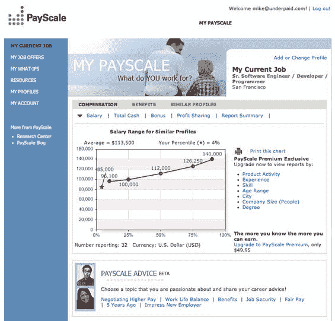

# 你挣多少钱？

> 原文：<https://web.archive.org/web/http://www.techcrunch.com:80/2006/10/12/how-much-money-do-you-make/>

  几个月前，我听说有一家新的创业公司要求用户公开自己的详细工资信息，作为回报，他们可以获得其他人的收入信息。这似乎是一个免费获取用户生成信息的好方法，而且有很多方法可以通过将聚合数据转售给第三方来赚钱。问题是这个名为 [wageexchange](https://web.archive.org/web/20230317184455/http://www.wageexchange.com/) 的网站完全令人失望。它只不过是一个向用户反馈数据的 web 表单。没有分析或深入挖掘趋势的能力等等。直到它变得更好，我们继续剖析它。

但是这个想法在我脑海中挥之不去，当我接到西雅图 PayScale 公司的电话时，我很高兴地得知这家公司一直在做 wageexchange 承诺的事情。这不是一家新公司——西雅图 PI 的约翰·库克已经写了关于他们的文章，其他西雅图本地作家也写了。但它对寻找工作或试图谈判加薪的人非常有用，我不确定我们需要一家新的创业公司来改进这项服务。

用户会经历一个披露其工作职能和薪酬详细信息的过程，并将其添加到 PayScale 所说的“世界上最大的薪资信息数据库”(每月新增 30 万份个人资料)。然后，用户可以访问数据库中的详细工资信息，包括基于工资、奖金、佣金、时薪、健康和假期福利的自定义报告。

基本服务是免费的，Payscale 通过向高级账户追加销售用户和向第三方出售聚合数据来创收。

这是一项非常有用的服务，对于花费时间向数据库添加内容的用户来说，这是一项巨大的回报。Payscale 已经在两轮中筹集了 1060 万美元的风险投资。投资者包括 Trinity Ventures、Madrona Venture Group、Fluke Venture Partners 和 Buerk Dale Victor。

