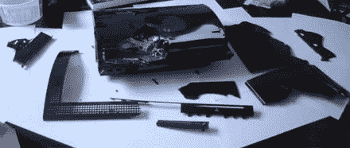

# 如何干掉一个 PS3 | TechCrunch

> 原文：<https://web.archive.org/web/http://techcrunch.com/2007/08/14/how-to-kill-a-ps3/>

这个世界上有一些生病的人，PS3 金库的那些家伙似乎是他们中最快乐的一群。该团队花了几个小时对 PS3 进行压力测试，让它完成了人类无法忍受的任务。他们测试 PS3 的每个环境都包括在游戏机上运行各种游戏和电影，每个环境总共运行 108 个小时。一个 73 华氏度的典型家庭房间没问题，但是把 PS3 扔进冷藏车后面的桑拿浴室？！闻所未闻！

我会把阅读细节的乐趣留给你自己，但 PS3 确实挺过来了。打赌一个 Xbox 360 在 73 F 的房间里都活不下来。

[如何杀死一台 PS3 主机](https://web.archive.org/web/20150514182102/http://www.ps3vault.com/how-to-kill-a-ps3-console-1975)【PS3 金库】