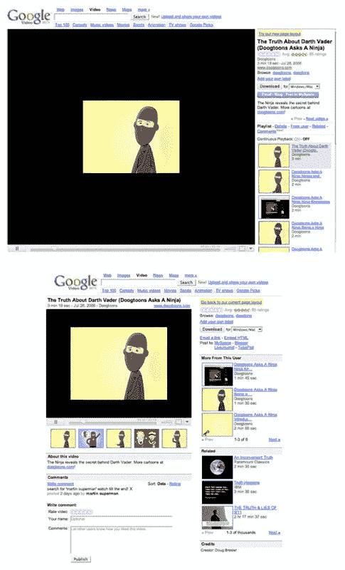

# 如何看待新的谷歌视频界面

> 原文：<https://web.archive.org/web/http://www.techcrunch.com:80/2006/08/12/how-to-see-the-new-google-video-interface>

# 如何看到新的谷歌视频界面

  我们在昨天的[帖子中提到谷歌正在测试一个新的观看视频的界面。Razvan Antonescu 给我发了一封电子邮件，告诉我如何亲自体验新界面。](https://web.archive.org/web/20220628193907/http://www.beta.techcrunch.com/2006/08/11/froogle-dumped-for-hot-new-girlfriend/)[谷歌博客](https://web.archive.org/web/20220628193907/http://blog.outer-court.com/archive/2006-08-05-n74.html)也写了这个。

要看的话，查看任意视频(比如[这个](https://web.archive.org/web/20220628193907/http://video.google.com/videoplay?docid=-3382491587979249836&q=type%3Amusic_video))，然后把网址替换成“javascript:setCookie('np '，' old ')；window . location . reload()；"然后回车。一个黄色突出显示的选项“尝试我们的新页面布局”将出现在右上角。点击它，你会看到新的布局。

主要的区别似乎是一个更小的，可调整大小的视频屏幕，视频下面更多的描述性数据和评论(最近增加的)。谷歌还在这个新屏幕上展示相关视频，以及将视频嵌入其他网站的更多方式。

旧界面(顶部)和新界面如下所示:

