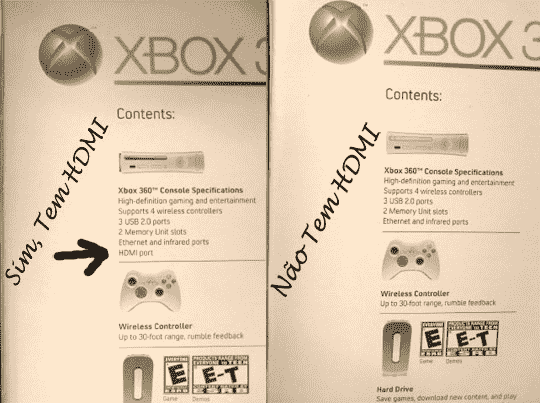

# 如何识别配备 HDMI 的高端 Xbox 360 | TechCrunch

> 原文：<https://web.archive.org/web/http://techcrunch.com/2007/08/10/how-to-spot-an-hdmi-equipped-premium-xbox-360/>

[哦，你不知道？](https://web.archive.org/web/20140109151526/http://youtube.com/watch?v=g_e9oVZFa8Y)微软用 HDMI 端口装饰了 [Premium Xbox 360](https://web.archive.org/web/20140109151526/http://crunchgear.com/2007/08/09/crunchdeals-xbox-360-premium-32999/) ，让你少了一个为 Elite 360 支付额外费用的理由。(我会为新的 [*光环 3* 360](https://web.archive.org/web/20140109151526/http://crunchgear.com/2007/08/09/high-rez-halo-3-xbox-360-pics/) 存钱，但这只是我的想法。)如何辨别配备 HDMI 的溢价？

嗯，它说它有一个 HDMI 端口。另外，你会在盒子上找到“泽法”这个词。

下课。

[某个家伙的 Photobucket 相册](https://web.archive.org/web/20140109151526/http://s173.photobucket.com/albums/w50/wonderkins/)【Photobucket via[Joystiq](https://web.archive.org/web/20140109151526/http://www.joystiq.com/2007/08/10/spot-the-hdmi-enabled-xbox-360-premium-at-retail/)