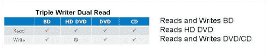

# 惠普有点妥协，也支持蓝光光盘

> 原文：<https://web.archive.org/web/http://techcrunch.com/2007/05/07/hp-kinda-caves-in-also-throws-support-behind-blu-ray-disc/>

# 惠普有点妥协，也支持蓝光光盘

过去，惠普是 HD DVD 论坛的成员，这意味着即使想一想[蓝光](https://web.archive.org/web/20131013135956/http://crunchgear.com/2007/01/17/blu-ray-cracked/)也是不允许的。当消费者[困惑](https://web.archive.org/web/20131013135956/http://crunchgear.com/2007/04/09/hd-video-sales-still-slow/)和/或不知道该回哪匹马[原故事标题](https://web.archive.org/web/20131013135956/http://crunchgear.com/2007/04/18/hd-dvd-sprints-ahead/)时，时间过得多快。两款新的惠普电脑 Pavilion Media Center m8010y 和 Pavilion d4890y 将能够读写蓝光光盘和 HD DVD 光盘。(当然，还有普通的 DVD 和 CD。)它计划成为个人电脑中发现的第一个混合驱动器。(但提醒你一下，不是第一部。)乐普莱斯，可惜，不得而知。当然是了。

[惠普推出蓝光 HD-DVD 组合光驱](https://web.archive.org/web/20131013135956/http://news.com.com/8301-10784_3-9716539-7.html?part=rss&subj=news&tag=2547-1_3-0-20)【CNET】