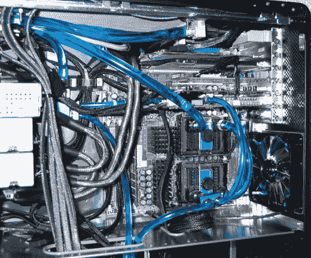

# 惠普准备今年秋季推出无风扇水冷笔记本电脑

> 原文：<https://web.archive.org/web/http://techcrunch.com:80/2007/05/08/hp-preps-fanless-water-cooled-laptops-for-this-fall/>

扣好安全带，男孩女孩们，因为惠普已经[另一个](https://web.archive.org/web/20160421181820/http://crunchgear.com/2007/05/07/hps-compaq-tablet-lineup-grows-by-one-the-2710p-it-comes-out-in-july/) [公告](https://web.archive.org/web/20160421181820/http://crunchgear.com/2007/05/06/hp-enters-gaming-notebook-market/)磨你的调色板，由我们的好朋友带给我们异端和谣言。该公司将在秋季推出一系列具有无风扇水冷功能的笔记本电脑。不，这不是第一台拥有水冷功能的笔记本电脑，但惠普致力于为普通人带来前沿功能，即使打着[巫术](https://web.archive.org/web/20160421181820/http://crunchgear.com/2006/09/28/hp-officially-announces-purchase-of-voodoo-pc/)的标签。假设该系统不会破坏电池寿命，我们可能会看到一台笔记本电脑不仅运行起来很酷，而且听起来不像喷气发动机。

[【独家新闻】惠普将于今秋推出巫毒水冷无风扇笔记本](https://web.archive.org/web/20160421181820/http://www.uberpulse.com/us/2007/05/hp_to_launch_watercooled_fanless_laptop_in_fall.php)【Uber pulse】