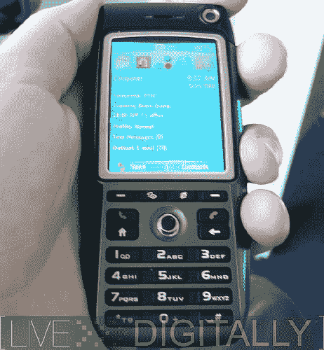

# HTC MTeoR:有史以来最好的智能手机？

> 原文：<https://web.archive.org/web/http://techcrunch.com/2006/09/19/htc-mteor-best-smartphone-evr/>

在关键时刻，我们倾向于喜欢 HTC(尽管布莱克讨厌他的 Cingular 8125)。与其他公司相比，他们推出了更多的智能手机，更多的外形和功能列表。他们与运营商达成价格协议的方式也令人惊讶。因此，毫不奇怪，在 Live Digitally 上看到 Ubergeek 杰里米·托曼(Jeremy Toeman)认为 HTC MTeoR 是有史以来最伟大的智能手机。

我们仍然在等待这个小家伙被一些美国运营商收养，这样它就可以有一个真正的，有教养的家。当这种情况发生时，任何人都在猜测，因为 HTC 正在给这个坏男孩打上自己的烙印，而不是让 T-Mobile 称之为 MDA 或其他一些卑劣的东西。

当 Toeman 说这是他用过的最好的智能手机时，你必须意识到这都是主观的。虽然我们肯定这是一款非常棒的手机，但我们中的一些人更喜欢 qwerty，而另一些人则选择全触屏操作。但是把这些偏好放在一边，MTeoR 确实累积起来，并为其他制造商设置了更高的标准。

HTC MTeoR:迄今为止最好的智能手机！，

[flickr 集](https://web.archive.org/web/20140120114505/http://www.flickr.com/photos/livedigitally/sets/72157594290583946/)