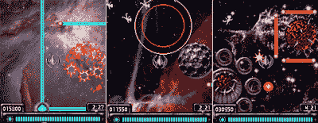

# 哈德逊娱乐公司大爆——TechCrunch

> 原文：<https://web.archive.org/web/http://techcrunch.com/2007/08/02/hudson-entertainment-makes-a-big-blast/>

# 哈德逊娱乐制造了一场大爆炸

今天，Hudson Entertainment 宣布 Gravity Blast 将适用于所有主流 BREW 和 Java 手机。基于空间街机游戏，你的任务是击退外星人入侵。

Hudson Entertainment 销售和营销副总裁 John Lee 表示:“移动游戏爱好者正在寻求新的游戏体验，而不仅仅是一个接一个的续作，我们很高兴展示像 Gravity Blast 这样的游戏。“游戏最初的简单性为所有类型的玩家打开了大门，但它的深度将安抚更多专注的游戏玩家。”

复古风格的游戏提供了 30 个级别的外星入侵者，以及四个 boss 枪战。准备锁定和加载！

[哈德逊娱乐](https://web.archive.org/web/20210123215104/http://www.hudsonent.com/)