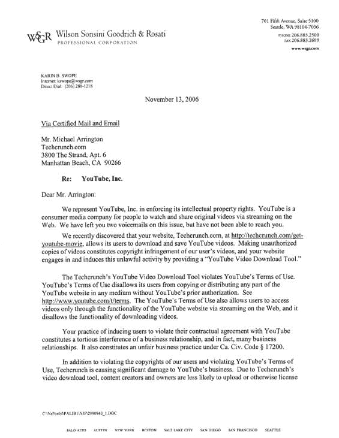
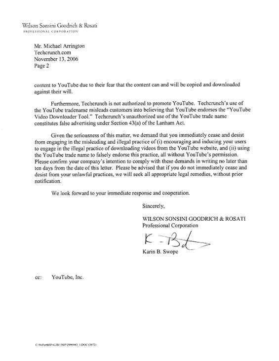

# 啊？YouTube 向 TechCrunch 发出了停止通知

> 原文：<https://web.archive.org/web/http://www.techcrunch.com:80/2006/11/15/huh-youtube-sends-techcrunch-a-cease-desist%5C>

今天晚上，我在我的电子邮件中发现了一封来自 Wilson sons ini Goodrich Rosati 律师事务所的停止信，他代表他们的客户 YouTube T4。我们被指控犯有多项罪行:违反 YouTube 的[使用条款](https://web.archive.org/web/20090109015536/http://youtube.com/t/terms)、“对商业关系的侵权干涉，事实上，是对许多商业关系的侵权干涉”、犯有“不公平商业行为”和“虚假广告”。律师继续要求我们停止参与这些不同的行动，否则将面临法律补救。

好吧，废话。

我们犯的错误是创建了一个小工具，让人们可以将 YouTube 视频下载到他们的硬盘上。我们在[最近的一篇](https://web.archive.org/web/20090109015536/http://www.techcrunch.com/2006/11/14/put-any-youtube-video-on-your-ipod/)文章中引用了这个工具，这篇文章带领人们完成了将 YouTube 视频转移到 iPod 的过程。

我们是在仔细阅读了 YouTube 的使用条款后才创建这个工具的，该条款规定*“如果你下载或打印一份内容供个人使用，你必须保留其中包含的所有版权和其他所有权声明。”*然而，这封信指出*“YouTube 的使用条款还允许用户仅通过 YouTube 网站的功能通过网络流媒体访问视频，并且不允许下载视频的功能。”*我不仅无法在 YouTube 的使用条款中找到该语言，而且它与我找到并在上面引用的语言直接冲突。

类似的工具在互联网上随处可见，而且已经存在了一段时间——参见 [Oyoom](https://web.archive.org/web/20090109015536/http://www.oyoom.com/) 、 [iTube](https://web.archive.org/web/20090109015536/http://www.benjaminstrahs.com/itube.php) 、 [PodTube](https://web.archive.org/web/20090109015536/http://djodjodesign.free.fr/rightEN.html) 、这个 [Firefox 扩展](https://web.archive.org/web/20090109015536/http://javimoya.com/blog/youtube_en.php)、一个 [O'Reilly 网站上的逐步说明](https://web.archive.org/web/20090109015536/http://oreillynet.com/mac/blog/2006/03/from_youtube_to_the_ipod.html)以及[更多的](https://web.archive.org/web/20090109015536/http://www.quickonlinetips.com/archives/2006/10/the-amazing-youtube-tools-collection/)。

即使被忽视，停止和终止信也经常被发送，而没有后续法律行动的意图。它们只是一种方式，表明你已经真诚地努力保护你的合法权利。但在这件事上，我感到困惑——YouTube 的立场是，上传到网站上的所有内容都获得了观众的使用许可，因此不应该有法律权利来保护:

> 您还特此授予 YouTube 网站的每个用户一项非排他性许可，允许其通过网站访问您的用户提交内容，并在网站功能和这些服务条款的许可下，使用、复制、分发、准备衍生作品、展示和执行此类用户提交内容。

鉴于下载，加上适当的版权归属，在使用条款下是允许的，用户下载一段视频供个人使用并放在他或她的 iPod 上似乎没有任何问题。

我已经将这封信发送给我的律师进行审查，但我可能会删除该工具，以维护我与公司的关系。根据我对使用条款和互联网上已经存在的大量类似服务的审查，我真诚地认为我们没有做任何冒犯 YouTube 或 Google 的事情。从我发现 YouTube 的第一天起，我就爱上了它。

当然，YouTube 指责别人侵犯版权的讽刺很好吃。但我现在不会深入讨论这个问题。

下面是这封信的副本。我没有听信中提到的语音邮件，但我去查看了最后 20 条信息，确实有两条来自这位律师。

**更新:** YouTube 的总法律顾问今天给我们发了一封邮件。经他们允许，我复制了以下内容:

> 嗨，迈克尔，
> 
> 我今天看到了你的帖子，很高兴你提出了这个问题。这里有一些想法可能有助于进一步解释。目前，YouTube 仅提供流媒体服务。我们不允许用户下载我们网站上的视频。我们相信我们的使用条款在这一点上是明确的，但鉴于今天引起我们注意的混乱，我们正在考虑修改我们的使用条款，以避免任何进一步的混乱。对于许多向 YouTube 上传内容并获得许可的用户来说，重要的是他们的内容只能用于流媒体。
> 
> 如果你有任何进一步的问题，不要犹豫给我发电子邮件。
> 
> 最诚挚的问候，
> 
> 扎哈瓦·莱文
> 
> 总法律顾问兼商务副总裁
> YouTube，Inc。

