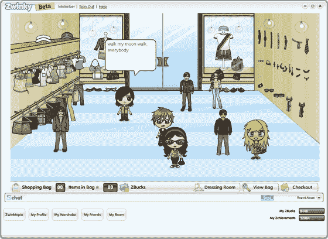

# IAC 在虚拟世界炒作的高峰期推出 Zwinktopia 

> 原文：<https://web.archive.org/web/http://www.techcrunch.com:80/2007/04/29/iac-launches-zwinktopia-at-peak-of-virtual-world-hype/>

互动公司推出一个新的青少年虚拟世界 [Zwinktopia](https://web.archive.org/web/20221218045938/http://www.zwinky.com/) 的时机再好不过了。其他虚拟世界，如 Gaia、Habbo Hotel、Cyworld、Neopets、Club Penguin、Webkinz 等，在每月独立访客和网站总停留时间方面正在[激增](https://web.archive.org/web/20221218045938/http://lsvp.wordpress.com/2007/04/23/kids-and-teens-have-pushed-at-least-6-immersive-online-worlds-to-over-2m-uumth-in-the-us/)。

直到今天，IAC 的 Zwinky 还是一个制作定制头像的网站，从 10，000 种不同的服装、配饰和其他物品中进行选择，并将它们嵌入到 MySpace 等其他网站上。用户还可以与其他用户成为朋友，并参与基本的社交网络活动。在这个空间也可以看到 [Stardoll](https://web.archive.org/web/20221218045938/http://www.stardoll.com/) 。

Zwinky 的大多数功能都是通过用户安装的非强制性浏览器工具栏来访问的。Zwinky 说他们在 2007 年 3 月使用了 2000 万个活动工具栏。Zwinky 的部分商业模式是从工具栏的使用中收取搜索广告收入。

今天，Zwinky 将在网站上添加一个名为 Zwinktopia 的虚拟世界——用户可以使用他们的头像在世界各地漫游，与其他用户聊天，并参加活动以赚取 Zbucks，Zwinktopia 的虚拟货币。Zbucks 可以用来购买虚拟服装和其他商品。

Zwinky 是 IAC 娱乐网站集团的一部分，该集团包括 Smiley Central、Cursor Mania 和其他网站，年收入超过 1 亿美元。Fun Webs 组是消费者应用和门户组的一部分(iWon 和 Excite 属于这个组)，由 Scott Garell 领导。

仅 Zwinky 在 3 月份(康姆斯克)就有 470 万全球独立访客，远远超过 Second Life 和上面第一段中列出的其他竞争对手。如果其中的合理数量可以转化为探索 Zwinktopia，它将成为除魔兽世界之外最大的沉浸式世界。请参见下面的康姆斯克比较数据(仅限美国)。

参见 GigaOm 最近关于 Gaia 的[文章](https://web.archive.org/web/20221218045938/http://gigaom.com/2007/04/22/move-over-myspace-gaia-online-is-here)，它可能在功能上最接近 Zwinktopia。

***更新:**该公司将于周一在美国全国广播公司(NBC)上播放宣传 Zwinktopia 的电视广告。*

[http://video.google.com/googleplayer.swf?docId =-4628271642650138617&HL = en](https://web.archive.org/web/20221218045938/http://video.google.com/googleplayer.swf?docId=-4628271642650138617&hl=en)