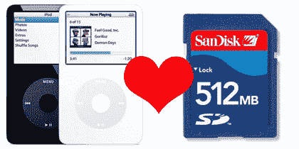

# iAlbum 可以让你将照片直接从相机上传到 iPod | TechCrunch

> 原文：<https://web.archive.org/web/http://techcrunch.com/2007/01/04/ialbum-lets-you-bring-photos-directly-from-camera-to-ipod/>

曾经想从你的数码相机里拍下精彩的照片，然后马上把它们放到你的 iPod 上吗？多亏了 iPhoto、iTunes 和 iPod 同步功能，我从来没有也可能永远不需要这么做。但是，也许你有一台个人电脑，或者需要把数码相机里的照片直接放到你的 iPod 里？向我问好。

Sakar International 的 iAlbum 是一个小配件，它可以将 SD 卡记忆棒中的照片直接传输到你的 iPod 中，而不需要电脑。它可以与 4G(彩色/照片)和 5G iPods 兼容，有黑白两种颜色，售价约为 90 美元。虽然我不需要它，但它的价格不算太贵。iAlbum 将于本月晚些时候上市。

[我允许从 SD 记忆棒中传输 iPod 照片](https://web.archive.org/web/20160305082515/http://ilounge.com/index.php/news/comments/ialbum-to-allow-ipod-photo-transfers-from-sd-memory-stick/)