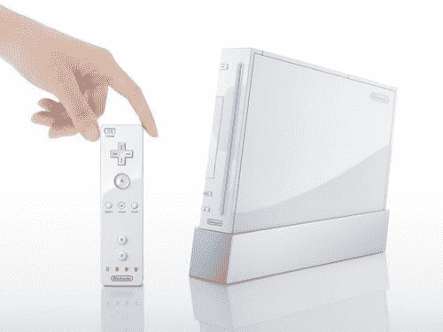

# IBM 发布 Wii 芯片

> 原文：<https://web.archive.org/web/http://techcrunch.com/2006/09/08/ibm-shipping-wii-chips/>

# IBM 发布 Wii 芯片

[IBM 今天](https://web.archive.org/web/20130627214452/http://www-03.ibm.com/press/us/en/pressrelease/20213.wss)宣布，它已经开始向任天堂运送用于 Wii 的基于 Power 架构的芯片。然而，我们仍然没有确定的价格或发布日期。也许任天堂正计划采取苹果式的举措，他们宣布一切，并立即可用。也许是，但很可能不是。我想玩[营战 2](https://web.archive.org/web/20130627214452/http://media.wii.ign.com/media/849/849911/vids_1.html) ，所以他妈的快点。

Wii 芯片大约在 3 周前开始发货