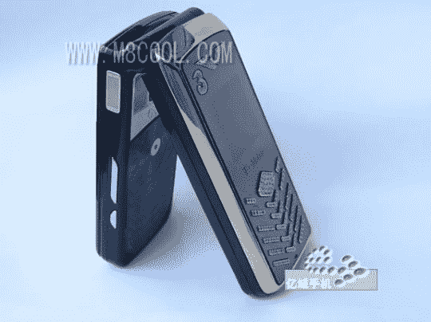

# iCool Phone 是二合一手机

> 原文：<https://web.archive.org/web/http://techcrunch.com/2007/08/07/icool-phone-is-two-phones-in-one/>

你是世界旅行家吗？我的朋友，你需要新的 iCool G700。它从外面看起来像一部 Vertu candybar 手机，但翻开它，又有一部手机看起来像摩托罗拉 RAZR 翻盖手机(除了更胖)。

你可以使用两张不同的国际 GSM SIM 卡。这两款手机共用同一块电池，而且可以同时开机，因为它们使用不同的主板。

在中国可以买到(我想)大约 200 美元。

[翻盖 iCool G700 配真双模](https://web.archive.org/web/20150915142644/http://www.slashphone.com/111/7815.html)【Slashphone】

[产品页面(已翻译)](https://web.archive.org/web/20150915142644/http://www.eemobi.cn/mobile/13/774/3411.aspx)