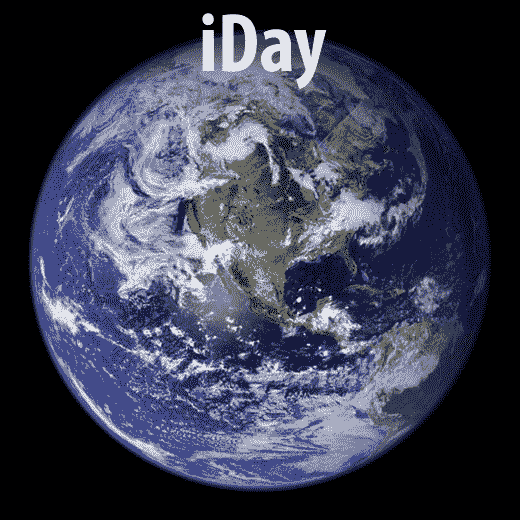

# iDay:iPhone 发布的时候你在哪里？TechCrunch

> 原文：<https://web.archive.org/web/http://techcrunch.com/2007/07/02/iday-where-were-you-when-the-iphone-launched/>

# iDay:iPhone 发布的时候你在哪里？

2007 年 6 月 29 日星期五。在营销行话 iDay 中，这一天苹果发布了一个小工具，迫使成年男子使用“棒极了”和“酷”这样的词来描述一部比大多数手机都更好的手机。那天你在哪里？下午 6 点，当它正式启动时，你在哪里？这场盛大的仪式通常是为罗马的胜利而准备的。一整天我都在外面，在曼哈顿拍照，并对自己嘀咕这一切是多么的愚蠢。然后，在那个决定命运的时刻，我和彼得去了 SoHo 商店，看着斯派克·李无所事事地站在前门，等着开门。

亲爱的读者，你在哪里？在办公室？像狄更斯一样刷新小工具博客？排队等你的宝贝？或者在当地的酒馆喝醉了？

[iPhone](https://web.archive.org/web/20130628171215/http://crunchgear.com/category/iphone/)