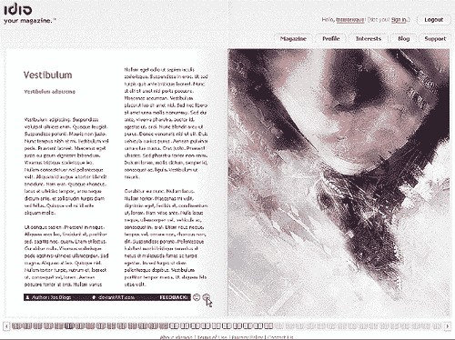
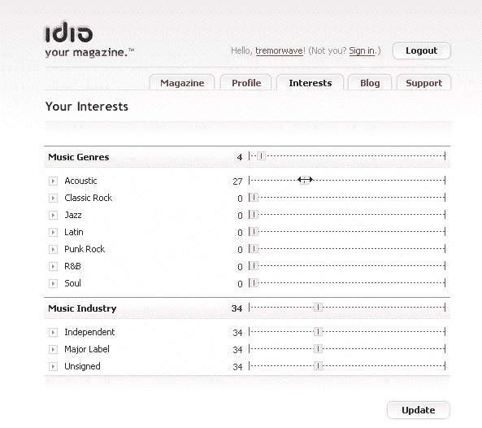

# Idiomag.com 今天晚些时候发布| TechCrunch

> 原文：<https://web.archive.org/web/http://techcrunch.com:80/2006/11/03/idiomagcom-launches-later-today/>

今天晚些时候，Idiomag.com 将发布公开测试版。该网站被宣传为个人在线杂志，将与 RSS 内容提供商分享广告收入——理论上，对于最大的媒体所有者来说，这可能是最小的博客——为 RSS 内容提供用户友好的界面，这将比 RSS 内容中笨重的横幅广告更有效地赚钱。

【T2

在给 TCUK 的一封电子邮件中，idiomag.com 的安德鲁·戴维斯说,“我们有大量的发布内容(在我们最初的设计和音乐内容领域),但显然还不足以满足每个人的兴趣——我们将在下个月大幅增加内容提供商的数量。我们的目标是到本月底，每天向每个用户提供 5 篇相关文章。我们有很多额外的功能，特别是在“社交网络”方向，但我们希望在允许太多“功能蔓延”之前引入基本概念“内容提供商尚未公布。[ **更新:**测试阶段最大的内容提供商是 [pixelsurgeon](https://web.archive.org/web/20130627210713/http://www.pixelsurgeon.com/) 和 [prefixmag](https://web.archive.org/web/20130627210713/http://www.prefixmag.com/) 。]
几乎不用说，idio 对读者是免费的。他们需要通过滑动条选择自己感兴趣主题的个人资料，从可用的内容提供商那里“创建”杂志。它将结合'光泽 RSS '与标签，加权和评级在一个闪光的界面。

戴维斯补充说，Idiomag 的目标是满足更主流的用户，他们没有时间或能力找到所有讨论他们各种兴趣的丰富的单一主题网站。

idio 的董事总经理爱德华·巴罗(Edward Barrow)表示:“目前网上有如此多的人才，用户生成内容和博客的爆炸式增长就证明了这一点。然而，这些人才中的大部分仍未得到认可，用户通常看不到他们制作的内容有任何回报。我们独特的商业模式使内容提供商能够最终分享他们的创造力带来的收入。”

至关重要的是，他们需要广告界的支持，他们的官方公关声明引用了安索帕全球媒体战略总监陈卿的热情，他说，idiomag“将阅读杂志的传统‘翻页’兴奋与数字时代的交互性和丰富的视觉呈现相结合。”

你可以在他们的[截屏中感受到这一点，但作为一个对新媒体广告思想的坚定观察者，我不得不说，我仍然确信这不是“你可以点击链接”的另一种说法。但在做出过于苛刻的判断之前，让我们先看看测试版。](https://web.archive.org/web/20130627210713/http://www.idiomag.com/screencast/)

 
营收宣传是提供极具针对性的广告“非侵入式”，全屏富媒体格式，虽然必须说 TCUK 还没有遇到非侵入式全屏富媒体广告。

有点奇怪的是，在这个详细的投资回报率和“n 次”点击分析的时代，idiomag 将使用传统的 CPM 印刷媒体收费格式，所以看看他们能从中获得多少牵引力将是有趣的。

**正如我们所知，有大量的基于网络的 RSS 阅读器获得了大量的流量，所以 idio 在 RSS 上的超级用户友好的面孔是否会起作用还有待观察。但这是一个如此不同的想法，他们可能只是有一个机会。** 
后面的故事，到这是巴罗想出的最初的主意。在参加华威商学院(Warwick Business School)的管理课程时，他遇到了安德鲁·戴维斯。安德鲁·戴维斯曾与几家跨国科技和媒体公司合作，同时也是德勤咨询公司的成员。