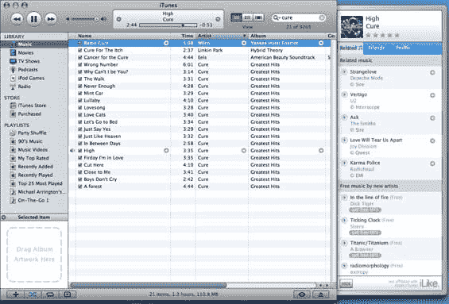

# iLike 添加了来自 YouTube——TechCrunch 的音乐视频

> 原文：<https://web.archive.org/web/http://www.techcrunch.com:80/2006/11/09/ilike-adds-music-videos-from-youtube/>

# iLike 添加了 YouTube 上的音乐视频

本周在三藩市举行的 Web 2.0 峰会上，有很多关于新社交音乐网站的讨论。我们最初在 10 月下旬的中介绍了它们——下载 iLike iTunes 侧边栏，查看与您所听音乐相关的音乐，以及您可能喜欢的独立音乐推荐，以及您和您的朋友在网站上所听音乐的大量统计数据。你也可以即时创建播放列表，还有很多其他功能我还在探索中。

有人称 iLike 是第二代 Last.fm，另一家我们已经跟踪了一段时间的公司[。](https://web.archive.org/web/20220810101614/http://www.beta.techcrunch.com/tag/last.fm)

本周早些时候，iLike 悄悄在网站上添加了 YouTube 音乐视频。iLike 上的每首歌曲都包含一个链接，可以播放实际歌曲的简短样本。现在还有一个“播放视频”的链接。点击链接，iLike 在 YouTube 上搜索视频，将其嵌入网站并开始播放。在我们的测试中，大约有三分之二的时候我能找到正确的音乐视频。

像 Gotuit 一样，iLike 现在也是一个很好的查找和观看音乐视频的服务。

顺便说一句，如果你想把 YouTube 视频下载到你的硬盘上，使用我们方便的 [YouTube 视频下载工具](https://web.archive.org/web/20220810101614/http://www.beta.techcrunch.com/get-youtube-movie/)。关于这一点的更多内容，以及将它转换成 iPod 格式的技巧，将在以后的文章中公布。

