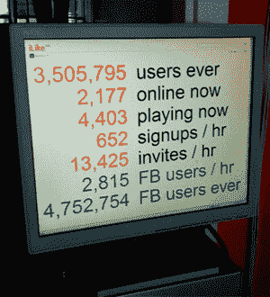

# 我喜欢奇妙的脸书问题

> 原文：<https://web.archive.org/web/http://www.techcrunch.com:80/2007/07/17/ilikes-wonderful-facebook-problem/>

 昨天我有机会参观了音乐社交网络 [iLike 的](https://web.archive.org/web/20220705164620/http://www.crunchbase.com/company/ilike)西雅图办公室，会见了联合创始人哈迪·帕托维。当我走进办公室时，我注意到的第一件事是一个平板显示器，显示公司的关键实时统计数据-见右图。我拍了一张照片，帕托维紧张地看着。这些数据以前从未公开披露过，但他同意我可以公布它们。

iLike [去年 10 月推出](https://web.archive.org/web/20220705164620/http://www.beta.techcrunch.com/2006/10/24/ilike-brings-free-indy-music-to-itunes-recommendations/)。九个月以来，他们已经聚集了 350 万用户(图中橙色的数据)，比二月份的 50 万有所增加。还不错。但真正令人印象深刻的是，在不到两个月的时间里，又有近 500 万人在脸书注册了这项服务，它是第三大最受欢迎的第三方应用。

差别只会越来越大——每小时有 2800 名脸书用户加入，而主网站每小时只有 652 名新用户。

iLike 脸书应用程序的流行很大程度上是由一种名为 iLike Music Challenge 的东西推动的，用户可以通过听一首歌曲的 30 秒片段来猜测歌曲或艺术家的名字。用户获得正确答案的分数(快速回答获得更多分数)，并与他们的朋友竞争。它非常容易让人上瘾，具有病毒式传播性——Partovi 说，平均用户会话持续多达 80 首歌曲。由于积分是公开的，我可以看到我的许多脸书朋友完全沉迷于此。查看下面的屏幕截图，点击查看大图。

**两套用户**

但是 iLike 有一个小问题，因为它有两组不同的用户使用两种不同的产品。他说，这两个群体之间没有太多重叠，因为脸书的应用程序没有在 iLike 网站上推广。

该公司目前正在投入资源来合并用户组，并使产品之间的功能相同(或至少更相似)。他们会从比较 cookies 开始寻找交叉用户。如果两个产品的 cookies 都在一个用户的浏览器上，他们会询问自己是否在两个产品上都有帐户，并有选择地合并它们。

在此过程中，他们将继续分别支持这两种产品。所有新的测试版特性都在这两个平台上发布，所以只需要移动遗留的东西。最重要的功能是从 iTunes 插件收集的数据——用户希望在脸书上显示播放列表和他们正在听的音乐。该公司表示，所有这些都将很快实现。