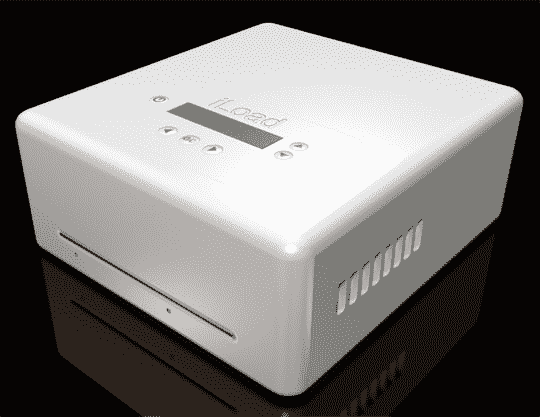

# iLoad 现在可以翻录 DVD，但还是很傻 TechCrunch

> 原文：<https://web.archive.org/web/http://techcrunch.com/2007/07/12/iload-can-now-rip-dvds-still-fairly-silly/>

# iLoad 现在可以翻录 DVD 了，还是很傻

这个[制作翼展 iLoad 的家伙](https://web.archive.org/web/20221028104054/http://gizmodo.com/gadgets/portable-media/iload-inventor-vents-is-out-on-bail-136934.php)对网络社区不太友好。他对那些认为产品是衍生产品且愚蠢的人的咆哮是出了名的，我个人曾被这家伙痛骂过两次。我让[肯·桑德查看](https://web.archive.org/web/20221028104054/http://crunchgear.com/2007/05/30/iload-review/)iLoad，因为我不想和它有任何关系。我认为他做得很好，很公平。它基本上是一台带有 USB 接口的小型电脑，可以抓取光盘，将 iPod 用作磁盘驱动器，通过直接读写 iPod 的隐藏目录来插入媒体。很公平，对吧？好吧，现在它撕 DVD。也就是说，这家伙现在可以使用一种神秘的“解决方案”来破解 DVD 分辨率是 320×240，在 iPod 的屏幕上可以接受，在 iPhone 上就不行了。你应该关心吗？不是特别喜欢。那里有很多免费的翻录产品，正如 [iLounge 在与 iLoad 的发明者“开战”后指出的那样](https://web.archive.org/web/20221028104054/http://backstage.ilounge.com/index.php/backstage/comments/getting-rid-of-iload-and-wingspan-the-full-story/)，以 iLoad 的价格，你可以得到一台功能齐全的笔记本电脑或台式机。五分钟的市场测试会告诉任何人这一点。

同样，如果你和玛莎有朋友来，你需要在 iPod 上录制一些咏叹调，以便连接到墙内 Bose 音响系统，我相信 iLoad 是适合你的。否则，就像其他自由的工业化世界一样下载 iTunes。

[iLoad 现在可以将 DVD 直接抓取到 iPod 上。iPhone 不兼容。](https://web.archive.org/web/20221028104054/http://crave.cnet.com/8301-1_105-9742158-1.html)【渴望】