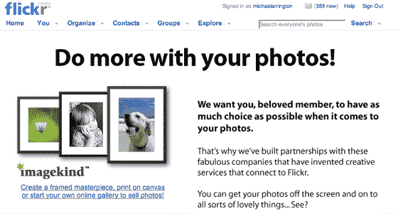

# ImageKind 与 Flickr  达成合作关系

> 原文：<https://web.archive.org/web/http://www.techcrunch.com:80/2007/04/19/imagekind-scores-partnership-with-flickr>

当我们在二月份[报道](https://web.archive.org/web/20160913201152/http://www.techcrunch.com/2007/02/25/imagekind-raises-26-million/)照片打印网站 [ImageKind](https://web.archive.org/web/20160913201152/http://www.imagekind.com/) 时，该公司表示他们即将宣布一项大型门户分销合作。

本月早些时候，一位读者向我们暗示，基于访问 Flickr API 的 ImageKind 网站上出现的一些代码，我们可能会与 Flickr 建立合作关系。如今，事实证明这位读者是对的——Flickr 推出了与 ImageKind 的整合。Flickr 用户现在可以为自己制作高质量的相框照片，或者通过在线商店出售。更多信息请访问 Flickr 合作伙伴页面，这里也展示了 moo、qoop 和 Zazzle 的整合…