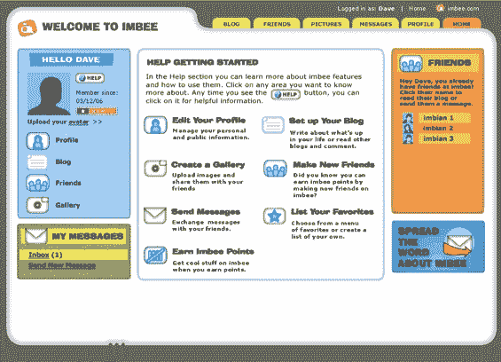

# 勤劳的孩子让父母观看儿童网络

> 原文：<https://web.archive.org/web/http://www.techcrunch.com:80/2006/06/16/industrious-kid-aims-to-network-children-safely/>

# 勤劳的孩子让父母观看儿童网络

 总部位于加利福尼亚州埃默里维尔的[勤劳的孩子公司](https://web.archive.org/web/20220818172452/http://www.industriouskid.com/)今天推出了一项名为 [Imbee](https://web.archive.org/web/20220818172452/http://imbee.com/) 的儿童社交网络服务。这项服务采取了强有力的措施来保证孩子们的安全。起初我持怀疑态度，但在了解了安全性是如何实现的之后，我认为这可能行得通。

该公司由创始人珍妮特·西蒙兹的 600 万美元资金创办。西蒙兹是 Ascend Communications 的联合创始人，该公司于 1999 年被朗讯以 240 亿美元收购。

Imbee 提供了其他社交网络服务的所有基本功能，除了聊天。最有趣的是父控件。持有信用卡的成年人需要创建 Imbee 帐户。然后，该成人可以选择新的博客帖子、孩子的评论和新朋友请求是否需要父母的批准才能传递到孩子的帐户。如果没有选择“适度”，父母仍然会收到孩子活动的电子邮件摘要。

许多人对年轻人能够在网上发布内容的一个担忧是，今天的愚蠢可能会在以后的生活中困扰年轻人。Imbee 表示，其网页位于防火墙之后，儿童内容被屏蔽，不会被搜索引擎编入索引。

网站本身没有搜索功能，如果不知道孩子的 Imbee 用户名，主动联系是不可能的。该系统中的所有孩子都会收到一个装满“名片”的 Imbee 钱包，他们可以将这些名片送给朋友，以共享这些用户名。

Imbee 的免费账户功能有限，全功能账户每月 4 美元或每年 40 美元。考虑到父母对孩子上网的担忧，这听起来是一个非常可行的价格方案。

孩子们会喜欢这个吗？如果需要父母的认可会让快速的意见交流和友谊变得太慢，他们可能不想这样做。该公司表示，这将是父母和他们的孩子之间的事情，他们预计，随着时间的推移，大多数父母需要批准的主要是新朋友请求。

如果加入 Imbee 的孩子年龄足够大，可以寻求这种服务，但又足够年轻，父母的控制对他们来说还不是一种诅咒——这可能是一个很好的系统。另一方面，控制孩子上网可能是一个失败的事业，教育保持安全可能是最好的选择。

