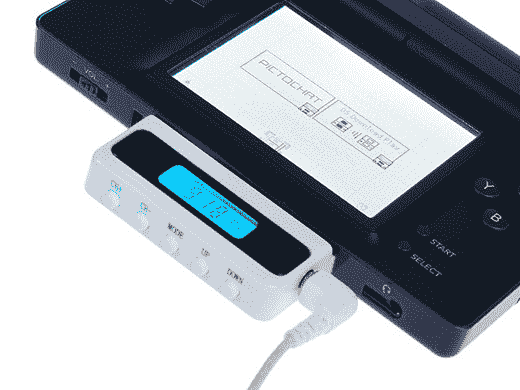

# 廉价的任天堂 DS 调频收音机插件 TechCrunch

> 原文：<https://web.archive.org/web/http://techcrunch.com/2007/04/17/inexpensive-nintendo-ds-fm-radio-add-on/>

# 廉价的任天堂 DS 调频收音机插件

虽然调频广播的受欢迎程度开始下降，但有些人仍然喜欢一些经典摇滚、体育广播或 NPR。白兰度知道这一点，并为任天堂 DS 创造了一个非常漂亮的附加组件，让你可以收听调频广播。它能吸走你的 DS 电池，有一个明亮的单色屏幕。最棒的是。只要 14 美元！拿起一个，实际上开始从你的任天堂 DS 中获得一些不是用 *Elektroplankton 制作的音乐。*

[产品页面](https://web.archive.org/web/20210304225634/http://videogame.brando.com.hk/prod_detail.php?prod_id=00452)【via[Gizmodo](https://web.archive.org/web/20210304225634/http://gizmodo.com/gadgets/peripherals/fm-radio-adapter-for-the-nintendo-ds-252844.php)