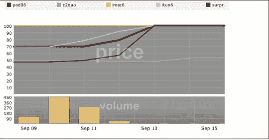

# 暗示:看不见的手预测 iPods 和其他东西

> 原文：<https://web.archive.org/web/http://techcrunch.com:80/2006/09/15/inkling-the-invisible-hand-predicts-ipods-other-stuff/>

# 暗示:看不见的手预测 iPods 和其他东西

是一个基于自由市场预测结果的幻想股票市场。它是这样工作的:用户创造问题和潜在的结果(“明天会下雨吗？”“比尔·盖茨会在哪个大型技术会议上脱下人类的皮肤，展示他高高在上于瑞尼尔山之上的天使般的美丽？”)和其他用户基于他们对特定结果是真实的信念来买卖股票。

这一点在[苹果公司上周发布的](https://web.archive.org/web/20130627211948/http://inklingmarkets.com/market/show/2099)中得到了最好的展示(完全披露:我真的很想把这一点与发布联系起来，但我当时在洛杉矶的 CTIA 华美达酒店，无法上网)。正如你从这张图表中看到的，各种结果最终接近 100 美元或百分点，那些在这些结果中购买“股票”的人得到了总数的一个百分比。

这和小玩意有什么关系？市场的无形之手倾向于最“理性”的结果，对吗？市场是基于不完美的信息，人类和机器试图使信息完美。随着越来越多的人买股票，他们用他们最好的判断和一点内幕消息来命名他们的价格。因此，正如我们从上升的条形图中看到的，有人对苹果有所了解 Core 2 Duo 的结果徘徊在 50%,其余的随着公告的发布而飙升。

因此，像 Inkling 这样的市场可以告诉我们很多关于特殊产品发布的潜在结果。然而，这仅仅是开始。

比方说，你正在制作一个小部件。小部件应该在预算和截止日期之内，所以你向你的同事提出一个问题“我们会在预算之内按时完成我们的小部件吗？”你提供四种结果，让他们匿名购买每种结果的股票。由此产生的图表将描绘出最有可能的结果，因为从营销人员到技术人员，每个人都有发言权。技术人员会说一切都将结束，营销人员会说一切都将结束，程序员会说这将需要一段时间，但会在预算之内，他们可以在休息室使用更多类型的糖果。这种组合会给你一个很强的指示，让你知道你面对的是什么。

我们将在多个主题上进行检查，我们可能会不时地创建一些市场来衡量对各种事物的总体感觉。很明显，现在市场规模有点小，但我相信这是一个有趣而有效的决策工具，也是找出谁将在 07 年管理小熊队的好方法。