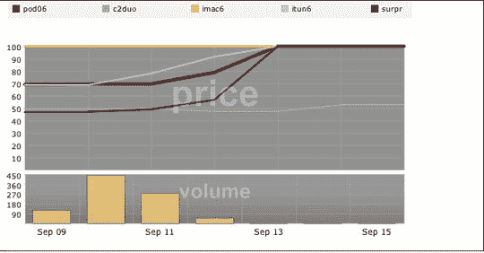

# 暗示:看不见的手说小熊队可能会赢

> 原文：<https://web.archive.org/web/http://www.techcrunch.com:80/2006/09/15/inkling-the-invisible-hand-says-cubs-may-win-it/>

# 暗示:看不见的手说小熊队可能会赢

是一个根据自由市场预测结果的虚幻股票市场。它是这样工作的:用户创造问题和潜在的结果(“明天会下雨吗？”“比尔·盖茨会在哪个大型技术会议上脱下人类的皮肤，展示他高高在上于瑞尼尔山之上的天使般的美丽？”)和其他用户基于他们对特定结果是真实的信念来买卖股票。

我们在 [CrunchGear](https://web.archive.org/web/20220929201034/http://crunchgear.com/2006/09/15/inkling-the-invisible-hand-predicts-ipods-other-stuff/) 会上对 Inkling 和小工具进行了更详细的介绍，但迄今为止，Inkling 已经预测了苹果的两次发布，并在乔布斯 9 月 12 日发布之前取得了相当好的表现，如下所示。

然而，Inkling 的真正策略是帮助决策。比方说，你正在制作一个小部件。小部件应该在预算和截止日期之内，所以你向你的同事提出一个问题“我们会在预算之内按时完成我们的小部件吗？”你提供了四种结果，并让他们匿名分享每一种结果。由此产生的图表将描绘出最有可能的结果，因为从营销人员到技术人员，每个人都有发言权。技术人员会说一切都会结束，营销人员会说一切都会结束，程序员会说这需要一段时间，但会在预算之内。这种组合会给你一个很强的指示，让你知道你面对的是什么。

这一总体概念——从各种结果中创造独特的市场——已经在 Cantor Fitzgerald 和他们的[好莱坞证券交易所](https://web.archive.org/web/20220929201034/http://hsx.com/)实施，尽管 Inkling 为中小型企业创造白标市场的使命非常好。这是一个很好的方式，通过过滤掉语言、情感和人际交往来获得每个人的意见，我们都知道，这些会毒害大脑。