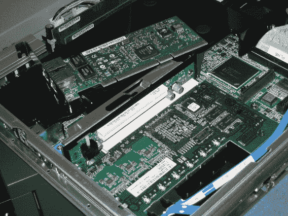

# 单一故障网卡导致的疯狂的 LAX 延迟

> 原文：<https://web.archive.org/web/http://techcrunch.com/2007/08/15/insane-lax-delays-cause-by-single-faulty-network-card/>

整个周末，近 2 万人滞留在洛杉矶国际机场的航站楼和飞机上。太糟糕了。如果你曾经被困在机场，哪怕只有一小会儿，你都会知道情况有多糟糕。有几个小时，我开始谋杀混蛋。那里很糟糕。

这就是新闻，但它是如何发生的？桌面终端中的一个有故障的网卡在整个网络中发送无用的数据，使整个局域网瘫痪。一点都不好笑，真的，但是很难不笑。

航空公司经营者请注意:这就是你从出价最低的人那里购买的结果，在这个案例中，Sewart 的电脑和百吉饼店，虽然有不错的百吉饼，但制作的是蹩脚的廉价 Peecees。

期待洛杉矶国际机场的全面审计和升级。可怜的家伙。

 [松懈的停机归咎于单台电脑](https://web.archive.org/web/20150926210644/http://www.latimes.com/news/nationworld/nation/la-me-lax15aug15,1,6802259.story?coll=la-headlines-nation&ctrack=1&cset=true)【洛杉矶时报】