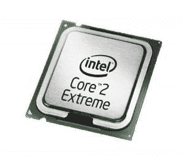

# 英特尔走极端！

> 原文：<https://web.archive.org/web/http://techcrunch.com/2007/07/16/intel-goes-extreme/>

随着英特尔酷睿 2 至尊 X7800 移动式双核处理器的发布，笔记本电脑游戏玩家将获得真正的享受。两个内核都将以 2.6GHz 运行，同时为消费者和制造商提供高能效特性。它的运行效率也比以前的移动处理器高 28%。对于超级极客来说，总线比率锁已经被移除，所以可以说你可以释放野兽。

台式机没有被宣布推出的酷睿 2 至尊 QX6850 四核处理器忽略，该处理器主频为 3GHz，系统总线速度更快，为 1，333MHz。游戏玩家无疑会对英特尔的这些新处理器感到兴奋。呆子。

[新闻稿](https://web.archive.org/web/20170705191516/http://www.intel.com/pressroom/archive/releases/20070716corp_a.htm?iid=pr1_releasepri_20070716ar)