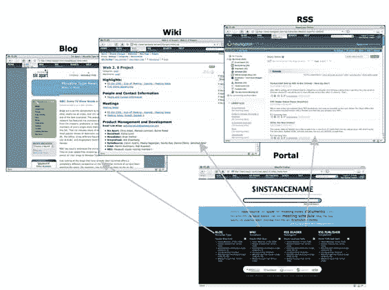

# 英特尔“SuiteTwo”产品套件发布

> 原文：<https://web.archive.org/web/http://www.techcrunch.com:80/2006/11/07/intel-suitetwo-product-suite-launches/>

# 英特尔“SuiteTwo”产品套件发布

  英特尔将于今日发布 [SuiteTwo](https://web.archive.org/web/20211026105829/http://www.suitetwo.com/) ，这款产品将众多企业 2.0 应用整合到一个集成套件中。此次发布的四款产品分别是 SixApart 的 [MovableType](https://web.archive.org/web/20211026105829/http://www.movabletype.org/) 、 [SocialText](https://web.archive.org/web/20211026105829/http://www.socialtext.com/) 、 [Simplefeed](https://web.archive.org/web/20211026105829/http://www.simplefeed.com/) 和 [Newsgator](https://web.archive.org/web/20211026105829/http://www.newsgator.com/) 。该套件将允许公司轻松安装、设置和集成这些产品，并将以自托管形式和托管服务的形式提供。通过这些产品，该套件包括一个博客平台、一个 wiki 和用于订阅和发布订阅源的应用程序——使其成为真正的 web 2.0 焦点。

该套件由 [SpikeSource](https://web.archive.org/web/20211026105829/http://www.spikesource.com/) 开发并整合，该公司还将支持和维护新的产品套件。英特尔将通过其渠道合作伙伴、分销商和直销渠道分销 SuiteTwo。SpikeSource 已经集成了套件中的所有产品，并包括一个门户，允许用户查看来自不同产品安装的所有主要信息(通过 feeds)。

整个套件的成本将在每年每套 150 美元到 200 美元之间，这比每个组件单独的成本都要高，但 SpikeSource 和英特尔希望通过集成这些产品，使它们易于一起使用，从而增加足够的价值，使该套件对企业具有吸引力。除了每个座位的许可费，公司还需要为运行套装所需的中间件应用程序(web 服务器和数据库服务器)支付许可费。该套件的收入将转移到四个应用程序提供商身上(SpikeSource 也有分成)。英特尔不会从该产品中获得任何收入。

SuiteTwo 的订单现已在网站上接受，并将在 2007 年 Q1 发布时完成。还计划在目前包含的四个产品之外推出该套件，第二阶段可能包括播客、社交网络、VoIP 和/或 IM。该套件具有潜力，因为它可以使企业更容易采用企业 2.0 产品，如博客和维基，但缺点可能是所有这些对一些企业来说太多了，他们可能会选择独立采用这些产品。

