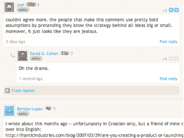

# 激烈的辩论增加了你的博客评论 TechCrunch

> 原文：<https://web.archive.org/web/http://www.techcrunch.com:80/2007/08/07/intense-debate-soups-up-your-blog-comments/>

# 激烈的辩论增加了你的博客评论

 总部位于科罗拉多州的创业孵化器 [TechStars](https://web.archive.org/web/20230219102942/http://www.crunchbase.com/company/techstars) 今天推出了他们的第二家公司[激烈辩论](https://web.archive.org/web/20230219102942/http://www.crunchbase.com/company/intensedebate)。本周早些时候，我们报道了 TechStar 的第一家公司 [MadKast](https://web.archive.org/web/20230219102942/https://techcrunch.com/2007/08/03/madkast-easily-sydicate-your-blog-in-one-line-of-code/) 。

激烈辩论是一个增强的博客评论系统，为出版商和评论者增加了许多功能。在您的博客(WordPress、Blogger 和 TypePad)上安装该插件可以增加线程、评论分析、所有博客的批量评论审核、用户信誉和评论聚合。你可以在 TechStars 博客上测试这个系统，但是如果你想自己安装的话，你必须申请私人测试版。

跟帖评论并不新鲜，很少有博客能吸引足够多的评论来进行分析。然而，当涉及到针对个人评论者的功能时，该系统确实大放异彩。

虽然你仍然可以留下匿名评论，但是注册一个账户可以把你的评论变成一个迷你博客平台。这个系统可以让你建立声誉，链接个人资料，交朋友，整合你的评论。由于所有的账户都在激烈的争论中，它可以跟踪你在任何博客上的活动。插件的网络优势将使它成为像 WordPress.com 这样的博客网络的巨大补充。

您的个人资料由可选照片、其他社交媒体个人资料的链接、您最近的评论和朋友组成。你可以在这里看到大卫·科恩的简介[。有了个人资料，其他用户就可以通过 RSS 轻松跟踪你在所有博客或特定博客上的评论。你的声誉是基于你的评论数量和其他用户投票的质量。](https://web.archive.org/web/20230219102942/http://intensedebate.com/users/4/)

激烈的辩论与其他几个评论系统争夺你博客上的空间，如 [JS-Kit](https://web.archive.org/web/20230219102942/https://techcrunch.com/2007/04/23/js-kit-web-2-for-lazy-people/) 、 [SezWho](https://web.archive.org/web/20230219102942/http://sezwho.com/) 和 [Tangler](https://web.archive.org/web/20230219102942/http://www.crunchbase.com/company/tangler) 。JS-Kit 让你用几行代码就可以轻松地添加评分和评论，但是没有用户档案系统。SezWho 有一个非常相似的评论系统，适用于 WordPress 和 Movable Type。Tangler 有一个即将发布的嵌入式评论小部件，它可以将实时论坛系统带到你的博客中。CoComment 有一个类似的系统，但是不需要插件就可以跟踪任何博客的评论。

该系统为多产的评论者提供了很多价值。事实上，许多 TechCrunch 的评论者已经建立了自己的追随者和声誉。像这样的系统提供了使它们显式化的基础设施。然而，对于想要拥有自己用户数据的大型博客来说，这可能是一个艰难的销售。