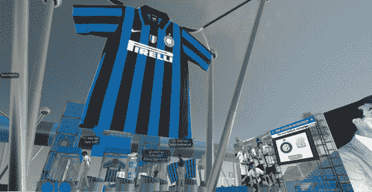
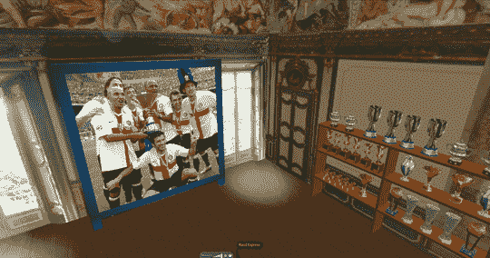
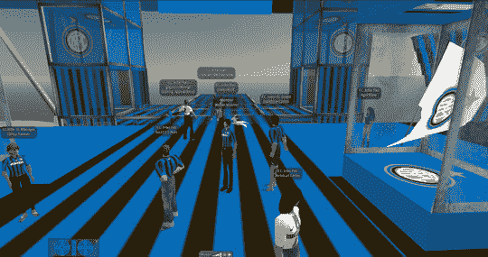

# 国际米兰在 Second Life | TechCrunch 上发布新主场球衣

> 原文：<https://web.archive.org/web/http://techcrunch.com/2007/07/30/inter-milan-launches-new-home-kit-on-second-life/>

我讨厌 [*第二人生*](https://web.archive.org/web/20150910152443/http://crunchgear.com/category/second-life/) 然而我喜欢足球，所以接下来的这个故事让我陷入了一个尴尬的境地。国际米兰今天在充满失败者和零的网络世界推出了新的主场球衣。我参观了该地区，看看国际米兰的忠实球迷在做什么。事实证明，并不多。

不过，这是国际米兰。没人喜欢他们。

抛开所有非理性的仇恨，这实际上是“游戏”中一个整洁的小区域。我知道也许你们中的六个人知道什么是 Inter-things，但是对于那些知道的人，请欣赏我的令人敬畏的新闻调查图片。

现在做一个[bara](https://web.archive.org/web/20150910152443/http://en.wikipedia.org/wiki/FC_Barcelona)区，我会更开心。

让我们看看国际米兰能否赢得冠军杯，因为米兰和尤文已经回到了竞争中。

[今天第二人生国际米兰特别活动](https://web.archive.org/web/20150910152443/http://inter.it/aas/news/reader?N=26941&L=en&IDINI=26953)【国际米兰 via [路透社/雅虎！](https://web.archive.org/web/20150910152443/http://sports.yahoo.com/sow/news?slug=reu-worlddigest&prov=reuters&type=lgns) ]

[SL 网址](https://web.archive.org/web/20150910152443/http://slurl.com/secondlife/Inter%20Official%20Site/237/134/28)【第二人生】